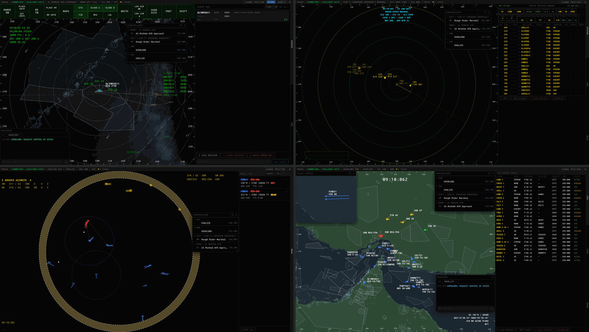
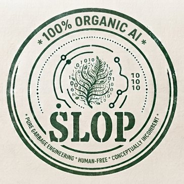

# TRACS — Tactical Radar And Control Suite

[](https://discord.gg/5W6cuezyPD)
[](https://github.com/denimchickensoft/TRACS/releases/latest)
[](https://github.com/denimchickensoft/TRACS/actions/workflows/ci.yml)
[](https://github.com/denimchickensoft/TRACS/releases)

[](LICENSE)



A desktop control suite for DCS World multiplayer servers, providing ATC, CATCC, AIC, and ABM scopes.

Each controller runs TRACS on their own machine. TRACS reads unit data from three possible sources:

- the [DCS Olympus](https://github.com/Pax1601/DCSOlympus) mod's REST API
- a direct connection to Tacview's Real-Time Telemetry export
- a **TRACS Relay** running on or near the DCS server, which can also relay Tacview data

Whichever source you use, a TRACS Relay can also supply SRS transponder/IFF data. Controllers sync with each other through the relay when one is available, and peer-to-peer over WebRTC otherwise. The peer-to-peer method requires no shared server.

**Operator guides** live in [`docs/`](docs/index.md): connecting, signing in, and every module's commands.

| Module                 | What it is                                                                                               |
| ---------------------- | -------------------------------------------------------------------------------------------------------- |
| [ATC](docs/atc.md)     | Air Traffic Control — STARS-style approach/departure radar, plus ASDE-X ground radar, PAR, and Strip Bay |
| [CATCC](docs/catcc.md) | Carrier Air Traffic Control Center — Carrier locked scope, synchronized Status Board, PAR, and Deck view |
| [AIC](docs/aic.md)     | Air Intercept Controller — AWACS/GCI focused scope, declarations, BRAA list, ROE, PICTURE                |
| [ABM](docs/abm.md)     | Air Battle Manager — Mission-wide: ATO/FRAG from `.miz` imports, IFF correlation, custom drawings, MGRS  |

---

## Installing TRACS (controllers)

Download the installer for your platform from the latest `v*` release on the [Releases page](https://github.com/denimchickensoft/TRACS/releases):

| Platform | Package                                     |
| -------- | ------------------------------------------- |
| Windows  | NSIS installer (`.exe`)                     |
| macOS    | `.dmg` (universal: Apple Silicon and Intel) |
| Linux    | `.AppImage`                                 |

The builds are not code-signed. Windows SmartScreen and macOS Gatekeeper will warn on first launch.

**macOS:** because the app isn't signed, macOS may say "TRACS is damaged and can't be opened" instead of offering to open it. After dragging TRACS into Applications, clear the download quarantine flag once from Terminal:

```sh
xattr -dr com.apple.quarantine /Applications/TRACS.app
```

**Updates:** TRACS checks GitHub Releases at launch.

- On Windows and Linux it asks before downloading an update, then offers to restart and install it.
- On macOS it shows a notice with a link to the release page, and you install the new `.dmg` yourself.

**Local server and port:** the app runs its own local server in-process, on port 8722 or the next free port. The first port that works is remembered for later launches, because saved preferences are tied to it. If another program is using that port at launch, TRACS names the program and lets you retry after closing it, use a nearby port for that session only (without your saved preferences), or quit. The remembered port is stored in `port.json` in the app data folder (see below).

**Menu:**

- **File → New Window** opens another TRACS window.
- **File → Open Logs Folder** shows the log file.
- **File → Open Config Folder** shows the config files described below.

**App data folder:** TRACS keeps its per-user files here: `port.json`, the `config` folder, the navigation data cache, and saved scope state.

| Platform | App data                               | Log file                        |
| -------- | -------------------------------------- | ------------------------------- |
| Windows  | `%APPDATA%\tracs\`                     | `%APPDATA%\tracs\logs\main.log` |
| macOS    | `~/Library/Application Support/tracs/` | `~/Library/Logs/tracs/main.log` |
| Linux    | `~/.config/tracs/`                     | `~/.config/tracs/logs/main.log` |

**Navigation data (LittleNavMap):**

- The installer bundles theatre geography, terrain, elevation, and airport data.
- Fixes, navaids, airways, and procedures come from your own [LittleNavMap](https://albar965.github.io/littlenavmap.html) Navigraph database (a `.sqlite` file).
- On launch, if no database is configured, TRACS explains what it needs and lets you pick the file, skip for now, or stop being asked. It extracts the data, and at each later launch re-extracts automatically if the file has changed.
- Without a database, those layers are unavailable (fix and procedure commands reply `NO NAVDATA`) and everything else works.
- To set or change the database later, open **Settings → Navigation data → Change…**. The new data takes effect the next time you sign in to a position.

**Config files:**

- TRACS stores a few hand-editable config files in the `config` folder inside the app data folder. They're seeded from bundled defaults on first launch, and never overwritten once present, so your edits survive every update.
- `rateConfig.json` — radar scan-rate cadence (unit position/detection refresh intervals) for direct-mode Olympus/Tacview connections. Each value is 1000-60,000 ms; anything below 1000 is raised to 1000.
- `tacviewDetectionConfig.json` — synthetic radar-detection model tuning for Tacview-sourced connections (sensor ranges, RWR behavior, scan cone).
- `airspace_colors.json` / `asdex_colors.json` — STARS/ASDE-X display color palettes.
- `rateConfig.json` and `tacviewDetectionConfig.json` are read when TRACS connects to its data source, so edits take effect the next time you sign in (or restart TRACS). The color files apply the next time a scope loads.
- There is no in-app editor for these — edit the JSON files directly. Use **File → Open Config Folder** to find them.

Then follow [Getting Started](docs/getting-started.md) to connect and sign in.

---

## Known limitations

- **Peer-to-peer sync depends on public Nostr relays.**
  - Without a TRACS Relay, controllers find each other through public Nostr relays; TRACS uses five at once.
  - Some of them reject TRACS's messages, and each rejection is logged to the developer console as a relay failure (for example `pow: insufficient leading-zero bits` or `blocked: kind not accepted here`). Others are sometimes unreachable. These errors are harmless while at least one relay works.
  - If none connects within about 8 seconds, TRACS falls back to its own local server. That only connects windows on the same machine, so controllers on different machines won't see each other.
  - **If sync is unreliable, run a [TRACS Relay](#running-a-tracs-relay-server-operators).** With a relay configured, TRACS doesn't use Nostr at all.
- **No TURN server.** Peer-to-peer connections can fail between two strict-NAT networks (for example, two cellular hotspots) and between machines behind the same router. A TRACS Relay avoids this.
- **Privacy of peer-to-peer signaling.** Without a TRACS Relay, connection setup messages pass through public Nostr relays, and Google's STUN servers see your public IP address. The connection details are encrypted only when you set a session password, so set one if that matters to you.
- **Unsigned builds.** Windows SmartScreen and macOS Gatekeeper warn on first launch. On macOS, updates are installed by hand from the Releases page.
- **Navigation data needs your own LittleNavMap Navigraph database.** Without it, fixes, navaids, airways and procedures aren't available.
- **Not every STARS command is implemented.** See [ATC known limitations](docs/atc.md#known-limitations) for the list.
- **Tacview detection is simulated.** In Tacview mode, radar and RWR fog-of-war is TRACS's own approximation, not DCS's detection data.
- **One coalition per running TRACS.** All windows share one data feed, so every window uses the coalition and password of the first login. To switch coalitions, close and reopen TRACS.
- **Game Master / Admin on a relay see only their own controller sync.** A relay keeps each coalition's controller sync separate. The relay would allow a Game Master or Admin into every coalition's, but TRACS doesn't join more than one yet.

## Data sources

- **Olympus** — requires the Olympus mod and its server application on the DCS server. TRACS polls its REST API with your coalition's Olympus password.
- **Tacview** — requires Tacview Real-Time Telemetry enabled on the DCS server. TRACS connects straight to it with the Tacview RTT password.
- **Relay** — a TRACS Relay connects to Tacview for you, and adds SRS transponder data and relay-hosted sync.

A Relay can also be used alongside Olympus or Tacview, only for SRS data and sync. See [Getting Started](docs/getting-started.md#1-connect) for the connection fields.

---

## Running a TRACS Relay (server operators)

The relay is a standalone executable, usually run on the DCS server machine next to SRS. It is optional. When present, it:

- listens to **SRS's LotATC export** (UDP) and serves transponder data (Mode 1/2/3/4, status) to every connected controller at `/transponders`;
- hosts **centralized sync** between controllers at `/sync`;
- optionally connects to **Tacview Real-Time Telemetry** once and fans it out to controllers at `/tacview` (Relay mode on the connect screen).

All three are served on one WebSocket port. The same port answers `GET /health` with the relay's version, protocol version, uptime and which capabilities are active, for monitoring.

### Setup

1. From the latest `relay-v*` release, download `TRACS-Relay.exe` (Windows) or `TRACS-Relay` (Linux), plus `config.example.json`.
2. Put them in one folder, and copy `config.example.json` to `config.json` in that folder.
3. In SRS's server settings, enable the LotATC export and point it at the relay machine, on the port set as `srsLotatcPort` (10712 by default).
4. Open `wsPort` (8765 by default) to controllers.
5. Run the executable.

Controllers enter the relay's port as **Relay Port**. The relay must be reachable at the same host as the **Server URL** they connect with.

### `config.json`

Each key falls back to the environment variable listed, then to the default.

| Key                  | Env var                | Default                          | Meaning                                                                                                                                                              |
| -------------------- | ---------------------- | -------------------------------- | -------------------------------------------------------------------------------------------------------------------------------------------------------------------- |
| `srsLotatcPort`      | `SRS_LOTATC_PORT`      | `10712`                          | UDP port the relay listens on for SRS's LotATC export                                                                                                                |
| `wsPort`             | `RELAY_WS_PORT`        | `8765`                           | WebSocket port controllers connect to                                                                                                                                |
| `tacviewHost`        | `TACVIEW_HOST`         | `''`                             | Tacview RTT host. Leave empty to disable the Tacview capability                                                                                                      |
| `tacviewPort`        | `TACVIEW_PORT`         | `42674`                          | Tacview RTT port                                                                                                                                                     |
| `tacviewPassword`    | `TACVIEW_PASSWORD`     | `''`                             | Tacview's own RTT password                                                                                                                                           |
| `passwords`          | —                      | `{}`                             | Per-coalition passwords, e.g. `{ "blue": "…", "red": "…" }`. A client must supply the password for the coalition it connects as. Empty means no password is required |
| `unitUpdateMs`       | `UNIT_UPDATE_MS`       | `1000`                           | Radar update interval pushed to controllers in Relay mode, 1000-60,000 ms (`config.example.json` uses `4000`)                                                        |
| `detectionMs`        | `DETECTION_MS`         | `1000`                           | Detection update interval, 1000-60,000 ms (example: `4000`)                                                                                                          |
| `missileDetectionMs` | `MISSILE_DETECTION_MS` | `1000`                           | Missile detection update interval, 1000-60,000 ms (example: `4000`)                                                                                                  |
| `autoUpdate.mode`    | —                      | `window`                         | `notify`, `immediate`, or `window` (see below)                                                                                                                       |
| `autoUpdate.window`  | —                      | `04:00`–`05:00` America/New_York | `{ start, end, timezone }` daily maintenance window for `window` mode                                                                                                |

### Relay updates

The executable checks GitHub Releases for newer `relay-v*` versions at startup and every 15 minutes:

| `autoUpdate.mode` | When a new version is found                                                |
| ----------------- | -------------------------------------------------------------------------- |
| `notify`          | Logs that an update is available and does nothing else                     |
| `immediate`       | Downloads it, swaps the executable in place, and exits                     |
| `window`          | Does the same as `immediate`, but only inside the daily maintenance window |

The relay exits after swapping, so run it under a supervisor that restarts it (see [Running as a service](#running-as-a-service)).

### Running as a service

Run the relay under a service manager, so it starts with the machine and restarts after it exits. It exits after each self-update, so without a supervisor it stays down until someone restarts it. Always set the working directory to the executable's folder; `config.json` and the relay's state files live there.

**Windows (NSSM).** With [NSSM](https://nssm.cc/), from an administrator prompt (adjust the paths):

```bat
nssm install TRACS-Relay "C:\TRACS-Relay\TRACS-Relay.exe"
nssm set TRACS-Relay AppDirectory "C:\TRACS-Relay"
nssm set TRACS-Relay AppStdout "C:\TRACS-Relay\relay.log"
nssm set TRACS-Relay AppStderr "C:\TRACS-Relay\relay.log"
nssm set TRACS-Relay AppRotateFiles 1
nssm set TRACS-Relay AppRotateBytes 10485760
nssm start TRACS-Relay
```

**Linux (systemd).** Save as `/etc/systemd/system/tracs-relay.service`, then run `sudo systemctl enable --now tracs-relay`:

```ini
[Unit]
Description=TRACS Relay
After=network-online.target
Wants=network-online.target

[Service]
User=tracs
WorkingDirectory=/opt/tracs-relay
ExecStart=/opt/tracs-relay/TRACS-Relay
Restart=always
RestartSec=5

[Install]
WantedBy=multi-user.target
```

The service user needs write access to the folder, since self-updates replace the executable in place.

### Firewall

- **Inbound TCP `wsPort`** (8765 by default) from controllers.
- **Inbound UDP `srsLotatcPort`** (10712 by default) **only from the SRS server's address.** The relay trusts whatever arrives on this port.
- **Outbound** to Tacview's RTT port (if `tacviewHost` is set), and to `github.com` over HTTPS for self-updates.

### Security

- **Always set `passwords`.** An empty `passwords` object lets anyone who can reach the relay connect as any coalition. The relay logs a warning at startup when no passwords are set.
- **Keep `config.json` private.** It holds the passwords in plain text, so make it readable only by the account that runs the relay.
- **Password guessing is rate-limited.** Ten wrong passwords from one address within a minute block that address for 30 seconds, doubling with each repeat up to 10 minutes.
- **Only give passwords to players you trust.** Anyone with a coalition password is trusted as a controller on your relay.
- **Traffic isn't encrypted by default.** Controllers connect over plain `ws://`, so passwords and data can be read by anyone who can watch the network between them and the relay. For an internet-facing relay, put it behind TLS (below), or use a trusted network or a VPN.

### TLS (`wss://`)

The relay itself speaks plain WebSocket. To encrypt it, put a TLS reverse proxy in front of it on the same machine. [Caddy](https://caddyserver.com/) is the simplest, because it gets and renews certificates automatically. With a DNS name pointing at the relay machine, this `Caddyfile` serves the relay as `wss://relay.example.com:8766`:

```
relay.example.com:8766 {
    reverse_proxy 127.0.0.1:8765
}
```

- **Firewall:** open TCP 8766 to controllers, and 80/443 for Caddy's certificate checks. **Close `wsPort` (8765) to everything outside the machine**, so no one can bypass TLS.
- **Controllers** enter the **Server URL** with `https://` (e.g. `https://relay.example.com`) and **8766** as the Relay Port; TRACS then connects to the relay over `wss://`. The `https://` applies to everything at that host, so in Olympus mode Olympus must be served over HTTPS too (for example behind the same Caddy). Relay mode and direct Tacview mode are unaffected.
- **Password limits keep working per controller:** Caddy passes each controller's address in `X-Forwarded-For`, which the relay uses for connections arriving from the proxy on the same machine.

### Logs

The relay writes its log to the console only. Keep it with your service manager: NSSM's `AppStdout`/`AppStderr` settings above, or `journalctl -u tracs-relay` on Linux.

### Version compatibility

TRACS and the relay exchange a protocol version when they connect. If they don't match, the relay closes the connection with a message naming both versions. TRACS then shows "Relay protocol mismatch … — using peer-to-peer." and doesn't retry. Update whichever side is older. The Settings panel in TRACS shows the connected relay's version and protocol number.

---

## FAQ

### Applications like LotATC & Combined Ops already exist. Why use TRACS?

_First of all, those apps are great and you should support them. I own a LotATC license and have used it for years. TRACS was created in an attempt to remove barriers to entry for DCS participation. Some servers try to keep the amount of DCS-adjacent software running limited for performance reasons. I looked at common existing software that was already running on these servers and how I could interface with those to add new, easily accessible gameplay dimensions. That's how I decided on Olympus and Tacview. TRACS requires no additional software to be installed server-side and is decentralized. As long as the server allows connection to either of those two data sources, a user can connect and participate. No sign-ups, no action required by the server owner, and completely free and open source._

### How is TRACS different from other similar programs?

_Besides the aforementioned decentralization, I feel like other clients provide a one-size-fits-all approach to what are essentially very different control paradigms (ATC, CATCC, AIC, and ABM). TRACS was an attempt to rectify that. Each module is based (at least visually) on real-world systems._

### Is TRACS free? Will it stay free?

_TRACS will always remain free and open source. Donations are not accepted at this time._

### Do I need to own DCS, or any modules, to use TRACS?

_No. All that is required is the ability to access a DCS server running Olympus or Tacview RTT._

### Can I use TRACS in single-player?

_Yes._

### I control on VATSIM with CRC. Will TRACS feel familiar?

_Yes. The ATC module was designed with that premise in mind._

### Is TRACS affiliated with Eagle Dynamics, Tacview, DCS Olympus, SRS, or vNAS?

_TRACS is not affiliated with any other software or organization._

### Which data source should I use: Olympus, Tacview, or a Relay?

_This depends on your use case. Olympus vs Tacview is mainly server owner preference. TRACS Relay allows the dissemination of transponder data, which adds an additional realism/gameplay dimension, and can be used concurrently with Olympus or a direct Tacview connection. It also allows the server owner to limit direct connections to Tacview while still relaying that data._

_TRACS was originally designed with Olympus in mind._

_Tacview RTT is also only available with Tacview Advanced or Enterprise, and thus not free._

### Does the server admin have to install anything?

_No. Server owners can optionally install TRACS Relay to allow access to SRS transponder data and centralize the controller-to-controller communication._

### Do I need a LittleNavMap / Navigraph subscription?

_No. It is not required for the software to function, but it is where TRACS derives a lot of navigation data. LittleNavMap (LNM) is free and open-source software that contains a Navigraph-sourced, but expired, navigation database. A user with a Navigraph subscription can update their LNM database, and thus TRACS can utilize the updated data. It is also great software._

### Do controllers need to be in SRS to use TRACS?

_No. SRS is only utilized server-side for player transponder data when TRACS Relay is running. DCS does not expose the transponder data, so SRS must be used for that. The communication paradigm can be anything the players want to utilize._

### How many controllers can connect at once?

_In theory, as many as necessary for the mission._

### Does TRACS work on the server's own machine, or does it have to be a separate PC?

_TRACS can run on the server as well._

### Can I control both coalitions, or be a Game Master?

_Game Master and Admin sessions are available and see both sides. On a relay, though, TRACS currently joins only one coalition's controller sync at a time; joining both is on the roadmap._

### How realistic are the scopes? Are they meant to match real-world systems?

_The STARS system is heavily documented and simulated by various games and software, so the ATC module is steeped in realism. The other systems are all visually modeled on real-world systems to some extent; however, those systems are not publicly documented and in some cases, I'm sure, classified._

### Why don't I see some aircraft on my scope?

_Depending on how you're connected, there are various detection schemes. Olympus exposes DCS's actual detection paradigm, so that is what should be reflected on your scope. A mock-detection scheme was devised for the Tacview data source, since it does not implement one. It uses DCS-derived data, line of sight, and various physics models to approximate the DCS detection model, with some limitations._

### Can pilots see what controllers are doing, or file flight plans?

_Since it is decentralized, TRACS currently only receives data from DCS. A future Relay data source is planned that may change that._

_Flight plans can currently be imported from a `.miz`, `.csv`, or `.dtc` file._

### Does TRACS affect server performance or the pilots' frame rates?

_TRACS should have only a negligible effect on a DCS server's performance. It can't poll faster than 1Hz and it doesn't touch DCS directly._

### How do I report a bug or request a feature?

_Open an issue on GitHub and pick the **Bug report** or **Feature request** template. For bugs, attach your log file (**File → Open Logs Folder**, then `main.log`); it makes most problems much faster to track down. Please report security problems privately instead; see [SECURITY.md](SECURITY.md)._

### Can I contribute?

_Maybe. Bug fixes and features are considered. Read [CONTRIBUTING.md](CONTRIBUTING.md) first for setup and the checks a pull request needs to pass. For anything big, open an issue first so we can talk it over before you put the work in._

### Is this "AI slop"?

_You decide. This project did begin as an AI experiment. 100% of the code was created by AI. I'm gonna say yes._



---

## Running from source (developers)

Requirements: Node.js 22+ and Git.

```bash
npm install          # once, and after pulling dependency changes
npm run dev          # local server on :8721 + Vite dev server on :5173 (proxies /api and /ws)
```

Open `http://localhost:5173` in a Chromium-based browser (Chrome, Edge, Brave). Firefox and Safari are not supported.

| Command                          | What it does                                                                                                                   |
| -------------------------------- | ------------------------------------------------------------------------------------------------------------------------------ |
| `npm run build` then `npm start` | Build the client and serve it from the local server on `http://localhost:8722`                                                 |
| `npm run electron:dev`           | Build the client and run it inside Electron, as the desktop app does                                                           |
| `npm run dist:electron`          | Build an installer for the current platform into `dist-electron/` (stages bundled navdata first)                               |
| `npm run lint`                   | ESLint, plus a check that the generated copies of shared server files are in sync                                              |
| `npm test`                       | Unit tests (Vitest; tests live in `test/`)                                                                                     |
| `npm run knip`                   | Unused files/exports/dependencies report                                                                                       |
| `npm run sync:tacview-core`      | Regenerate the relay's and client's copies of shared server files (Tacview parser, protocol version, detection-config example) |

**LittleNavMap database in dev:** set the `LNM_DB_PATH` environment variable to your `.sqlite` file before starting the server. The Electron file picker doesn't exist in a browser.

**Relay from source:**

```bash
cd relay
npm install
npm start            # node index.js, reads relay/config.json
npm run build        # produce relay/dist/TRACS-Relay(.exe) + config.example.json
```

A relay run from source never updates itself.

**Mock Olympus server** for working without DCS:

```bash
node mock-olympus/server.js
```

Connect TRACS to `http://localhost:4001` in Olympus mode, with any password.

---

## Releasing (maintainers)

Releases are built by GitHub Actions when a version tag is pushed. The tag is the only source of the version number; the workflows write it into `package.json` at build time, so never edit `version` by hand.

| Tag            | Workflow                              | Produces                                                                                                                                                                                                                                                                                                |
| -------------- | ------------------------------------- | ------------------------------------------------------------------------------------------------------------------------------------------------------------------------------------------------------------------------------------------------------------------------------------------------------- |
| `vX.Y.Z`       | `.github/workflows/release-tracs.yml` | Windows NSIS, macOS universal dmg (plus the zip that macOS update checks read), and Linux AppImage installers, built on windows-latest / macos-latest / ubuntu-22.04 and published directly (not as a draft) to one GitHub Release by electron-builder. This release is what installed apps update from |
| `relay-vX.Y.Z` | `.github/workflows/release-relay.yml` | `TRACS-Relay.exe` (Windows), `TRACS-Relay` (Linux), and `config.example.json`, attached to one GitHub Release. This release is what running relays update from. Relay releases are never marked as the repo's "latest" release, because installed TRACS apps find their updates through that pointer    |

```bash
git tag v0.2.0 && git push origin v0.2.0
git tag relay-v0.2.0 && git push origin relay-v0.2.0
```

TRACS and the relay are versioned independently.

**Protocol changes:** when the TRACS ↔ relay wire protocol changes, bump the integer in `server/src/protocolVersion.js` and run `npm run sync:tacview-core` to regenerate the `client/src/webrtc/` and `relay/` copies. Then release both TRACS and the relay.

No code-signing certificate is used for any platform.

---

## Architecture

```
[DCS server] ──REST/TCP──▶ [TRACS local server] ──WebSocket──▶ [TRACS window]
      │                                                               │
      │  (optional, DCS-server-side)                        WebRTC peer-to-peer
      ▼                                                    (when no relay sync)
[TRACS Relay] ───────────────────────────WS──────────────▶ [Other controllers]
      │                                                  (relay sync, when available)
      └── SRS transponder data + Tacview telemetry to any number of controllers
```

- Each controller runs their own local server; in the desktop app it runs inside the app. The only component installed on the DCS server side is the optional TRACS Relay. Each controller's local server listens only on this machine (127.0.0.1), so other machines can't reach it. Setting the `TRACS_HOST` environment variable (e.g. `0.0.0.0`) opts in to LAN access; the server has no authentication, so only do that on a trusted network.
- Controller-to-controller sync uses the relay when one is reachable. Otherwise it uses peer-to-peer WebRTC.
  - Peer discovery uses the public Nostr relay network.
  - If no Nostr relay connects within ~8 s, it falls back to the controller's own local server, which only connects windows on the same machine (see [Known limitations](#known-limitations)).
- Sync rooms are coalition-scoped. A relay-hosted room is keyed on coalition, since each relay serves one mission. A peer-to-peer room is derived from the server address, the coalition, and the optional session password.

---

## Special thanks

Leroy, Alablm, Maple, IndyNavy, & the [Olympus](https://github.com/Pax1601/DCSOlympus) crew.

---

## License

Copyright (C) 2026 denimchickensoft.

TRACS is licensed under the GNU General Public License v3.0 or later — see [LICENSE](LICENSE). It comes with ABSOLUTELY NO WARRANTY.

TRACS includes third-party data, including OpenStreetMap data (© OpenStreetMap contributors, ODbL), terrain data from the USGS and others, data derived from DCS World, and unit databases from DCS Olympus. See [THIRD_PARTY_NOTICES.md](THIRD_PARTY_NOTICES.md) for sources, licenses and required attributions.

TRACS is an independent community project. It is not affiliated with or endorsed by Eagle Dynamics SA, the DCS Olympus team, Tacview, the DCS-SRS or LotATC developers, LittleNavMap, Navigraph, or any other organization or product it mentions. All trademarks belong to their respective owners.
