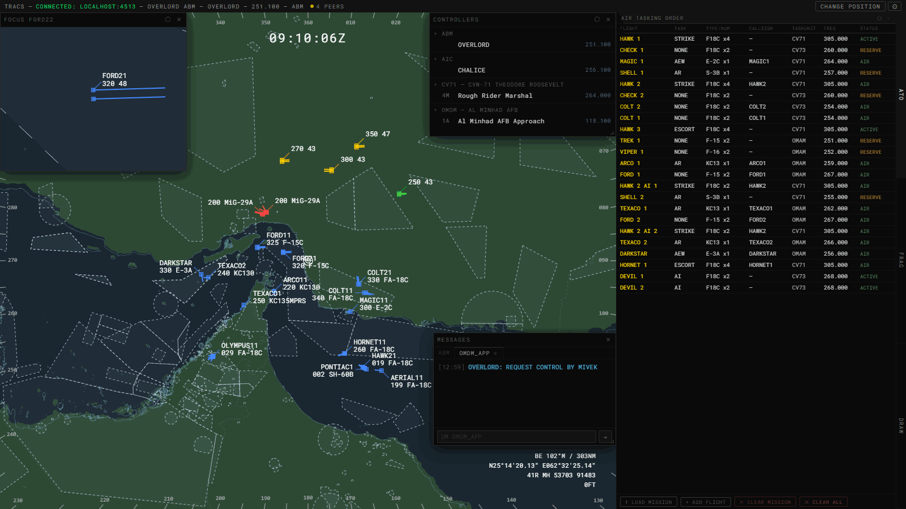

# ABM (Air Battle Manager)

[← All docs](index.md)

Mission-wide package tracking: a radar scope with map and reference layers, an ATO summary of every tasked flight, a FRAG drawer for per-package detail, and custom drawing overlays.

Sign-in requires a Callsign and Frequency, same as AIC — see [Getting Started](getting-started.md).

## SRS transponder data (IFF correlation)

When SRS transponder data reaches TRACS through a relay, ABM uses it for every contact that has reported SRS data at any point in the session ("SRS-fielded"):

- **Default declaration:** an SRS-fielded aircraft on your own side defaults to **BOGEY** until it's declared.
- **Correlation:** a contact is *correlated* when two things are true:
  - its live callsign matches an aircraft on a FRAG roster, and
  - either one of its live Mode 1/2/3 codes equals that roster row's assigned code, or its Mode 4 is on. Mode 4 has no assigned value.
- **Uncorrelated datablock:** line 1 cycles through the contact's live codes, one every 2 seconds (`M1 nn`, `M2 nnnn`, `M3 nnnn`, `M4 ON`). With no live codes, the datablock shows only the altitude/speed line.
- **Correlated datablock:** shows the callsign and aircraft type on the datablock and in the cursor readout. This depends on correlation alone, not on declaration. A contact declared FRIENDLY that stops correlating goes back to cycling codes.
- `.autodec iff` uses the same correlation (see Declaration below).

When a contact starts squawking IDENT, its datablock blinks (the same blink as clicking its FRAG roster row). Click the contact to stop it. ABM has no Beaconator display.

## Command line

Type into the buffer and press **Enter**.

A few commands are completed by clicking instead of Enter: type the command, then click the map or a contact. These are:
- `.be`, `.threat`, `.db`, `.dope`, `.rename`, `.frag`, and `.route`
- a bare digit 1–9 (leader direction)

The drawing commands (`.line`, `.rect`, `.circ`, `.poly`, `.sect`, `.race`, `.text`) run on **Enter**. After that, they wait for clicks on the scope to place any points you didn't type.

`ArrowUp`/`ArrowDown` cycle your last 50 commands. While a `.define` readout is open, they step through the brevity glossary instead.

`Escape` clears one thing per press, in this order:
1. a pending drawing-clear click
2. a pending "clear all drawings" confirm
3. an in-progress drawing
4. the find marker
5. a pending F-key declaration
6. a pending BRAA fighter
7. the RBL
8. the brevity definition readout
9. the command buffer and feedback
10. once the command line is empty, every route line on the scope

### Bullseye

| Command | Effect |
|---|---|
| `.be` (Enter, no click) | Reset to the mission bullseye (clears any override) |
| `.be` typed then click the map | Place an override bullseye at that point |
| `.be <fix>` | Override to a named fix/navaid/runway |
| `.be <lat> <lon>` | Override to explicit decimal-degree coordinates |

### Range rings

| Command | Effect |
|---|---|
| `.rr` | Toggle on/off |
| `.rr <dist>` | Set spacing in NM, or km under `.metric` (≤0 turns off) |
| `.rr <dist> <anchor>` | Set spacing and anchor to `bullseye`/`bs` or a named fix |

### Map & reference layers (bare toggles unless noted)

| Command | Effect |
|---|---|
| `.time` | Toggle the mission clock |
| `.unitro` | Toggle the cursor unit-proximity readout (on by default) |
| `.rose` / `.compass` | Toggle the compass rose (on by default) |
| `.geo` | Toggle coastlines/boundaries |
| `.relief` | Toggle terrain relief shading |
| `.holds` | Toggle holding patterns |
| `.mora` | Toggle the MORA/grid overlay |
| `.airways` | Toggle all airways; `.airways v`/`j`/`b` toggles just one class |
| `.asp` | Bulk-toggle every airspace category |
| `.tma` `.ctr` `.cta` `.fir` `.uir` `.sua` `.mil` `.trsa` `.classa`–`.classg` | Toggle one airspace category |
| `.aspcolors <name>` | Select an airspace color palette |
| `.refresh` | Reload airspace color palettes from the server |
| `.labels` (or `.lbl` / `.label`) | Toggle name labels for airspace *and* custom drawings |
| `.labelsize [0-5]` | Set airspace/fix/drawing label size; bare form reports the current value |
| `.fill` | Toggle polygon fill for airspace *and* custom drawings; `.fill <1-100>` sets transparency % and turns it on |
| `.custom` / `.cust` | Toggle all custom drawing layers |
| `.custom <name>` / `.cust <name>` | Toggle just the drawing(s) with that name |
| `.fixes` | Toggle theatre fix points |
| `.fix <name...>` | Force-show one or more fixes regardless of `.fixes`; each name toggles independently |
| `.fix` (no argument) | Clear every pinned fix for the current theatre |
| `.navaids` | Toggle navaids |
| `.find <fix>` | Drop a marker at a named fix |
| `.runways` | Toggle runways |
| `.taxiways` / `.polygons` | Toggle airport surfaces (taxiway and runway pavement) |
| `.airports` | Toggle `.runways` and `.taxiways` together: if either is on, both turn off; otherwise both turn on |
| `.mgrs` | Toggle the theatre-aware UTM/MGRS grid — see below |
| `.towns` | Toggle towns |
| `.base` / `.terrain` / `.water` / `.roads` | Toggle individual terrain raster layers; `.map` toggles all four together plus `.geo` |

**MGRS grid:**
- `.mgrs` detects how many UTM zones the current view spans and draws each zone-boundary seam.
- 100 km grid-square labels are reprojected on each side of a seam, alongside a grid-zone designator (e.g. "38S").
- 1 km and 10 km subdivision lines appear as you zoom in.

ABM does not display SID/STAR/approach procedures.

### Brevity glossary

`.define <term>` (or `.def <term>`) looks up a tactical brevity term (ATP 1-02.1, April 2025) and shows its full definition in a readout above the command line. Multi-word terms work as typed, e.g. `.define bogey dope`. A single letter, e.g. `.def a`, jumps to the first term starting with that letter. The readout stays up until you dismiss it: press Escape, run another `.define`, or click it.

### Cursor readout

| Command | Effect |
|---|---|
| `.coords` | Toggle the cursor lat/lng readout |
| `.ddm` / `.dms` | Set coordinate format |
| `.metric` / `.imperial` | Set display units for every ABM window and popup (default imperial). Metric shows distances in km, altitudes and elevation in m, and speeds in km/h, and typed distances (`.rr`, `.threat`, `.focus`, draw-command sizes, Drawings fields) are read in km. The BRAA line and RBL show ft under 1 NM, or m under 1 km |
| `.bec` | Toggle bullseye-on-cursor — bearing/range readout that follows the mouse |

### Contacts

| Command | Effect |
|---|---|
| `.ptl <0-5>` | Predicted track line minutes |
| `.faded <seconds>` | Coast/fade duration |
| `.history` / `.hist` | Toggle trails; `.history <len>` sets length (0=off, max 10); `.history <len> <rate>` sets length + capture rate |
| `.db` | Toggle global datablock visibility; typed (no Enter) + click a contact toggles just that one |
| `.dbreset` | Clear all per-contact `.db` overrides |
| `.dbca` | Datablock collision-avoidance placement (off by default): a track's own leader direction is always kept; every other datablock sits at the default leader direction (`.ld`) unless that would overlap another datablock, cross another leader, or cover another track, in which case it moves to the nearest clear direction |
| `.dbsize [0-5]` | Set aircraft datablock size; bare form reports the current value |
| `.dbs` | Formation datablock suppression (on by default). Among aircraft whose callsigns end in two or more digits (e.g. `ENFIELD11`, `ENFIELD12`), only the flight lead shows a datablock while the others are inside a 6×6 NM box around it. The box extends ±3 NM along and across the lead's heading |
| `.ll [0-7]` | Set leader line length (10 px per step); bare `.ll` reports the current value |
| `.ld <1-9>` | Set leader line direction (numpad layout); `5` returns to the default direction |
| `.bedb` | Toggle bullseye-on-datablock: adds a 3rd datablock line with each contact's magnetic bearing/range from bullseye, e.g. `090/20` (off by default) |

### Missile tracking & launch alert

In-flight missiles show as a small heading-oriented triangle, colored by the missile's actual coalition. Your own side's and neutral missiles always show. An enemy missile shows only once a friendly AWACS/EWR unit detects it. Only medium/large missiles (cruise missiles, anti-ship missiles, SAMs) can be detected; typical fighter-launched air-to-air missiles never appear. `.ptl` and `.history` (see Contacts above) apply to missiles too.

A newly detected hostile missile triggers an alert: a repeating tone, plus a blinking symbol and PTL. The alert lasts as long as the missile stays tracked, and clears automatically on impact, expiry, or lost detection. Click the blinking symbol to cancel the alert early. The sound and blink stop, and the missile keeps rendering normally.

| Command | Effect |
|---|---|
| `.malert` | Toggle the missile-launch alert on/off entirely |
| `.vol` | Show current master alert volume |
| `.vol <0-10>` | Set master alert volume (0 = mute) — shared by any ABM alert tone |

The app-wide **Sounds** checkbox in Settings (see [Getting Started](getting-started.md)) is a master mute that overrides `.vol`.

Only one tone plays however many ABM windows are open (main scope, focus panels, pop-outs), and dismissing it from any window silences it everywhere. `.malert` and `.vol` take effect from the main scope window.

### BRAA, bogey dope, threat rings

| Command | Effect |
|---|---|
| `.threat` (Enter) | Clear all rings; `.threat <dist>` (Enter) sets the default radius instead (NM, or km under `.metric`) |
| `.threat` / `.threat <dist>`, then click a contact | Toggle that contact's ring (optionally set radius) |
| `.tclear` | Clears RBL, all BRAA pairs, and all threat rings at once |
| `.dope`, then click | Bogey-dope the clicked contact to the nearest air contact declared hostile or bogey |
| `.rename` / `.rename <newcallsign>`, then click | Rename or reset a contact's callsign (synced to other controllers) |

BRAA pairs are drawn on the scope as a dashed line with an inline bearing/range label. ABM has no BRAA-list side panel.

### Declaration

| Command | Effect |
|---|---|
| `.dec` | Reset all declarations to default and turn auto-declare off |
| `.dec <old> <new>` | Bulk redeclare, letters `f`/`n`/`b`/`h` (friendly/neutral/bogey/hostile), e.g. `.dec b h` |
| `.autodec` | Toggle auto-declare by true coalition, with no IFF check. Turning it on applies to every visible contact; while on, newly visible undeclared contacts are declared too. Turning it off leaves existing declarations in place |
| `.autodec iff` | Toggle IFF-gated auto-declare, FRIENDLY only. A same-coalition contact without SRS data is declared unconditionally; an SRS-fielded one only when it's correlated (see SRS transponder data above). It never declares hostile/neutral/bogey. Mutually exclusive with `.autodec` |
| `.autothreat` | Auto-light threat rings on friendlies near hostiles/bogeys |

### ROE

`.roe free` / `.roe tight` / `.roe hold` — sets weapons status, shown top-left (state is shared with AIC). Bare `.roe` toggles visibility of the ROE readout itself (visible by default).

### Ground/naval acquisition & engagement rings

`.acq` / `.eng` (all) or `.acq <f|n|b|h>` / `.eng <f|n|b|h>` (one class)

### Ground/naval contacts

`.gc` (or `.groundcontacts`) shows or hides every ground/naval contact in this window, along with its acquisition/engagement rings. Hidden contacts also can't be clicked, focused, paired or found with `.where`, and don't trip threat rings. The setting is saved.

### Aircraft on the ground

ABM hides aircraft on the ground (parked or taxiing). `.tdm` (or **Ctrl+T** in the desktop app, **Alt+T** anywhere) toggles top-down mode for this window, which shows your own side's aircraft on the ground. They behave like any other friendly contact, except that they don't trip auto threat rings. Another side's aircraft on the ground never show, detected or not. An aircraft that lands, or is hidden again when you turn top-down mode off, disappears right away instead of fading out. The setting is saved.

GM/Admin sessions see every aircraft and ground/naval unit on both sides, without fog of war, and top-down mode shows both sides' aircraft on the ground.

### Scope drawing

Each command runs on Enter. Arguments you type are used directly; anything missing is placed by clicking on the scope. A point argument can be a fix/navaid/airport name or a coordinate (e.g. `N20W040`).

| Command | Effect |
|---|---|
| `.line [p1] [p2]` | Line between two points |
| `.rect [anchor]` | Rectangle: click the anchor (if not typed), then the opposite corner |
| `.circ [center] [radius]` | Circle |
| `.poly [p1 p2 ...]` | Polygon. Typing 3+ points draws it immediately; otherwise click to add vertices, and click within 12 px of the first vertex (with 3+ vertices placed) to close it |
| `.sect 
 <brg1> <brg2> ... <brgN> <radius>` | N-1 adjoining sectors at one center and radius (e.g. `.sect OMDM 270 090 100`). Bearings are magnetic |
| `.sect` | Click the center, then click again: draws a ±15° sector toward that point, with radius set by the click distance |
| `.race [fix] [radial] [leg] [L\|R] [turnRadius]` | Racetrack. Typing fix, radial (magnetic), leg length and turn direction draws it immediately (turn radius defaults to 1 NM); otherwise click the fix, then click to set the leg |
| `.text [anchor] <text>` | Text label: click to place it (if no anchor was typed), then click again to commit |

Typed sizes (radius, leg, turn radius) are in NM, or km under `.metric`. While placing a shape, headings snap to whole magnetic degrees and distances to whole NM (whole km under `.metric`). The scroll wheel rotates `.rect`, `.race`, and `.text` before you commit them. Escape discards an in-progress shape.

Clearing:
- `.dclear` (bare), then click a drawing — removes one shape.
- `.dclear all` — removes every hand-drawn shape after a `y`/`n` confirmation.
- `.dclear <name>` — removes shapes by name.

Hand-drawn shapes appear in the Drawings panel alongside imported layers. The drawings store is shared by every ABM window, so drawing or clearing in one window affects all of them.

### Callsign/route lookup by name

| Command | Effect |
|---|---|
| `.where <callsign>` | Toggle a blink on that contact's datablock |
| `.frag <callsign>` | Open FRAG for that contact's flight |
| `.route <callsign>` | Toggle that flight's route line on the scope |

All three accept a partial/prefix match and report `AMBIGUOUS` or `NOT FOUND` when a match isn't unique. `.frag` and `.route` also work typed without a callsign, then completed by clicking a contact. `.rclear` clears every route line on the scope, whether it was toggled with `.route`, Ctrl+Right-click, or FRAG's ROUTE header. Escape does the same once the command line is empty.

### Focus windows

A floating mini-scope locked onto one contact, or opened on an airfield or any point on the map.

| Command | Effect |
|---|---|
| `.focus <callsign>` | Open (or bring to front) a focus window on that contact, at your saved default range |
| `.focus <ICAO>` | Open a focus window on that airfield (used when no live callsign matches) |
| `.focus <coordinate or fix>` | Open a focus window on a point: a coordinate written as one word (`N24.43E54.66` or `24.43N54.66E`), or a fix/navaid id |
| `.focus <callsign, ICAO, coordinate or fix> <range>` | Same, with an explicit range in NM (km under `.metric`) |
| `.focus <range>` | Set the default range for future focus windows, without opening one |
| Double-click a contact on the main scope | Same as `.focus <callsign>` |
| Double-click a runway (while runways or airport polygons are shown) | Open a focus window on that airfield |
| Double-click anywhere else | Open a focus window on that point |

The callsign forms accept the same partial/prefix matching as `.where`/`.frag`/`.route`. A live callsign always wins; then an airfield ICAO, then a coordinate or fix/navaid.

A contact focus window stays centered on its contact, and snaps back if you pan it. An airfield or point focus window opens centered on its location and then pans freely. Double-clicking the same airfield or spot again re-centers the window that's already open.

A focus window is a full independent scope:
- Drag it to move it, and drag an edge or corner to resize it.
- The mouse wheel over its title bar adjusts its opacity.
- **⬡** pops it out into a separate OS window and closes the in-page panel. Popping out the same contact or location twice refocuses the existing popup.
- **×** closes it.

Display toggles (`.coords`, `.db`, `.geo`, etc.) apply to the window you type them in. Each toggle also becomes the starting setting for windows you open afterward. Drawings, `.custom`, `.malert`, and `.vol` are shared rather than per-window (see above).

## Mouse gestures

| Gesture | Effect |
|---|---|
| **Ctrl+Shift+Click** an aircraft | Open **FRAG** for its flight (see FRAG drawer below). Blue/red sessions can only do this on their own side's aircraft; GM/Admin can do it on either side |
| **Ctrl+Right-click** a contact | Toggle that flight's route line on the scope |
| **Shift+Click** | Remove BRAA pairs involving that contact |
| **Ctrl+Alt+Click** | Toggle a threat ring on that contact |
| **Ctrl+Click** | Start/complete a BRAA pair (first click arms a pending fighter, second click pairs it) |
| **Alt+Click** | Bogey-dope — auto-pair with the nearest air contact declared hostile or bogey |
| **Middle-click** | Toggle a persistent highlight; for ground/naval units this also pins their last known position on screen after they drop out of visibility |
| **Right-click + drag** | Pan the scope |
| **Left-click + drag** | Draw a range/bearing line |
| **Digit 1–9, then click** | Set that contact's leader-line direction (`5` returns it to the global direction) |
| **Double-click** a contact, runway or point | Open a Focus window on it |
| **Click** a blinking missile symbol | Cancel its launch alert |
| **Click** a contact with a blinking datablock | Stop the blink (FRAG roster, `.where` or IDENT) |
| **Mouse wheel** | Zoom, 1–600 NM: 1 NM per step inside 10 NM, 10 NM per step beyond (25 NM with Ctrl) |

**F1–F4** arm a pending declaration (Hostile/Bogey/Neutral/Friendly). The next click declares every contact within 10 px of the click point. Pressing the same key again cancels.

FRAG also drives the scope: clicking a flight's Base or a route waypoint in FRAG drops a marker on the scope, and clicking a roster row makes that contact's datablock blink.

## ATO drawer

A sortable table of every tasked flight, with these columns:
- Flight name
- Task
- Type/Num
- Callsign (resolved once live)
- **TASKUNIT** — airfield ICAO, carrier hull abbreviation, or "Air Start". FRAG's Tasking view labels this "Base".
- Frequency
- Status — **RESERVE** / **ACTIVE** / **AIR** / **TAXI** / **GROUND**. This is the most advanced state across all live-matched aircraft in the flight. RESERVE means none of the flight's aircraft has spawned yet.

Taskunit uses the flight's recorded departure. Air-start flights use their recorded recovery/landing point instead, if the mission has one.

Click a column header to sort (click again to reverse). Click a row to select that flight and open it in FRAG. Blue/red sessions see only their own coalition's flights; GM/Admin see all. Mouse wheel over the title bar zooms the panel (50–200%). Manually-added flights have a **×** to remove them.

**Footer:**

| Button | Effect |
|---|---|
| **⬆ Load Mission** | Import flights from a mission file (see Mission Import below) |
| **+ Add Flight** | Manually add a flight (see Add Flight below) |
| **✕ Clear Mission** | Clears imported flights only (shown when imported flights exist) |
| **✕ Clear ALL** | Confirm-gated, wipes manual flights too |

## FRAG drawer

Detail view for the flight selected in ATO, or opened with Ctrl+Shift+Click on the scope.

- **Tasking** — editable Task field, full Base name, and Status (same rollup as ATO). Click an airbase or carrier Base to drop a scope marker.
- **Roster** — one row per aircraft.
  - Imported flights: callsign, type, live-resolved callsign, onboard number, skill, air/ground state, ordnance summary (grouped by weapon with counts), a collapsible comms/radio list, and Link16 station if present.
  - Manually-added flights: callsign, type, and state, matched live against aircraft flying that callsign prefix.
  - A manual flight's roster ends with a **+ Add Aircraft** field. A typed callsign shows as **PENDING** until a matching aircraft goes live.
  - A **×** on a manually-added row removes its roster/IFF entry. A row matched live by callsign prefix stays listed after that.
- **IFF** — Mode 1 (2 digits), Mode 2 and Mode 3 (4 digits) fields under each roster row, for imported and manual flights alike. These are the assigned codes used for IFF correlation (see SRS transponder data above).
- **Route** — each waypoint's name, altitude, and speed; click one to drop a marker on the scope. Click the ROUTE header (yellow, green when active) to toggle the flight's route as a dashed line on the scope. The route line is hidden each time a flight is selected.

Mouse wheel over the title bar zooms the panel independently of ATO.

**What syncs to other ABM controllers:**
- IFF codes.
- Manual flights (name, callsign prefix, coalition, and roster) once they're created or changed through Ctrl+Shift+Click, + Add Aircraft, ×, or an IFF edit. A flight created with **+ Add Flight** is sent at its first such change.
- Imported mission data stays local to each controller.

**Ctrl+Shift+Click** on an aircraft opens its FRAG flight:
- The aircraft's live callsign is matched against every roster, imported and manual. `FORD11` matches an imported roster entry named `FORD 1-1`.
- If the aircraft is already on a roster, that flight opens.
- Otherwise TRACS opens (or creates) a manual flight for its callsign prefix (e.g. every `ENFIELD1x` aircraft together) and adds the aircraft with blank IFF fields.
- Repeating the click never creates duplicates.
- GM/Admin sessions file the flight under the aircraft's own coalition.

## Mission Import

**⬆ Load Mission** in ATO's footer.

- Drop a `.miz` file or a raw mission text file, or click to browse.
- Blue/red sessions only see their own coalition's tasked flights. The other side's flights are filtered out before the preview.
- The preview shows a count-by-task summary and the list of flights found, with a RESERVE badge for late-activation flights. **Import** replaces the previously imported set and keeps manually-added flights.
- ABM reads groups, units, routes, payloads, radios, and Link16 from the mission. It does not read triggers, trigger rules, or the mission's localization dictionary.
- **Dropping a `.csv` here instead** bulk-assigns IFF codes:
  - The header row must include a `callsign` column. `mode1`, `mode2`, and `mode3` columns are optional and can be in any order. Values are cut to 4 digits.
  - A preview lists what will be applied; **Apply** writes the codes.
  - It only fills in rows that already exist (from a mission import, Ctrl+Shift+Click, or manual entry), matched by callsign, and never creates flights. The first matching roster row wins.
  - Callsigns with no matching row are listed as skipped.

## Custom Drawing Import

**⬆ Load Drawing** in the Drawings panel, or drag a file onto the panel.

- **Accepted files:**
  - `.geojson`, `.json`, `.ndgeojson`, and `.ndjson`, several at once. Newline-delimited GeoJSON is supported, and bad lines in an ndjson file are skipped.
  - A `.zip` bundle, such as one exported from the Drawings panel.
  - A **`.miz` mission file** — imports its F10-map trigger zones and Drawing layers.
- A preview row with more than one feature has a **Split** button that turns each feature into its own layer, keeping each feature's own color.
- The preview lets you rename each layer (defaults to the filename) before importing. A failed file shows its error inline without blocking the others.
- **Layer color:** a layer whose features carry a GeoJSON `stroke` color takes that color, with Override turned on. Other layers use the current airspace palette's CUSTOM color.
- **Fill** is controlled by `.fill` (the same toggle as airspace). A feature fills with its own GeoJSON `fill`, or with its layer's overridden color. An unstyled shape only fills if the palette's CUSTOM entry defines a `fill`.
- Feature labels come from the GeoJSON's `title`/`name` properties, shown when `.labels` is on.
- Drawings are stored per theatre in your browser and shared across your own open windows. They are not sent to other controllers.

### Drawings panel management

| Item | Effect |
|---|---|
| Visibility checkbox | Show/hide the layer; the column header's checkbox toggles every layer |
| Layer name | Click to rename it inline |
| Color swatch + **Override** checkbox | Pick a custom color, or inherit the airspace palette's CUSTOM color |
| "Always show label" checkbox | Per-layer, independent of the global `.labels` toggle |
| INFO column | Feature count |
| Grip handle | Drag to reorder layers (draw/z-order) — available while the list isn't sorted |
| Color / name / label column headers | Sort, with a third click turning sorting off |
| Disclosure-arrow parameter editor | Command-drawn rectangles, circles, sectors, racetracks, and text only — rotation, radius, start/end bearing (magnetic), leg length, turn radius/direction, text, whichever apply |
| **×** | Delete the layer |
| **⬇ Export** | Bundle the panel's drawings into a zip that can be re-imported through Load Drawing on any TRACS instance |
| **✕ Clear ALL** | Delete every layer, with a confirmation |

Mouse wheel over the title bar zooms the panel.

## Add Flight (manual entry)

**+ Add Flight** in ATO's footer adds a flight that isn't in a mission file.

Fields:
- Flight Name (required)
- Task
- Type
- Num (aircraft count)
- **Callsign Prefix** (required) — flight name plus flight number, e.g. `SHELL1`, with no element digit
- Base/Taskunit — a dropdown of theatre airbases and live carriers
- Frequency
- Coalition — GM/Admin only; blue/red sessions use their own coalition

**Live-callsign matching:** a manual flight is matched to live aircraft by its Callsign Prefix. DCS joins flight and element numbers with no separator, so flight 1's aircraft are `SHELL11` and `SHELL12`. The prefix `SHELL1` matches both of them but not `SHELL21`.

## Keyboard shortcuts

| Key | Effect |
|---|---|
| `F1`–`F4` | Arm a pending declaration (Hostile/Bogey/Neutral/Friendly); press again to cancel |
| `Escape` | Clear pending state in the order listed under Command line |
| `Enter` | Run the buffered command |
| `ArrowUp`/`ArrowDown` | Cycle command history, or step through the glossary while a `.define` readout is open |
| `1`–`9`, then click | Set a contact's leader-line direction |
| `Ctrl+V` | Paste into the command line |
| `Ctrl+Alt+0`–`9` | Save the current view to bookmark slot 0–9 |
| `Ctrl+0`–`9` | Load view bookmark 0–9 |
| `Ctrl+T` (desktop app) / `Alt+T` | Toggle top-down mode (same as `.tdm`) |
| `Ctrl+Left` / `Ctrl+Right` | Reopen the last-used side panel / close the open one (app-wide, see Getting Started) |
| `Ctrl+Up` / `Ctrl+Down` | Switch between the ATO, FRAG and DRAW panels (app-wide, see Getting Started) |
| `Ctrl+M` | Open Messages (app-wide) |

---

## Known limitations

- Manually-added flights have no route, ordnance, radio, or Link16 data; only flights imported from a mission file have it.
- `.frag <callsign>`, `.route <callsign>`, and Ctrl+Right-click find only imported flights. Routes come only from `.miz` imports.
- Turning `.autodec`/`.autodec iff` off doesn't revert contacts it already declared; only a bare `.dec` does.
- Bogey dope (`.dope` / Alt+click) only targets air contacts, although BRAA pairs can include ground/naval units.
