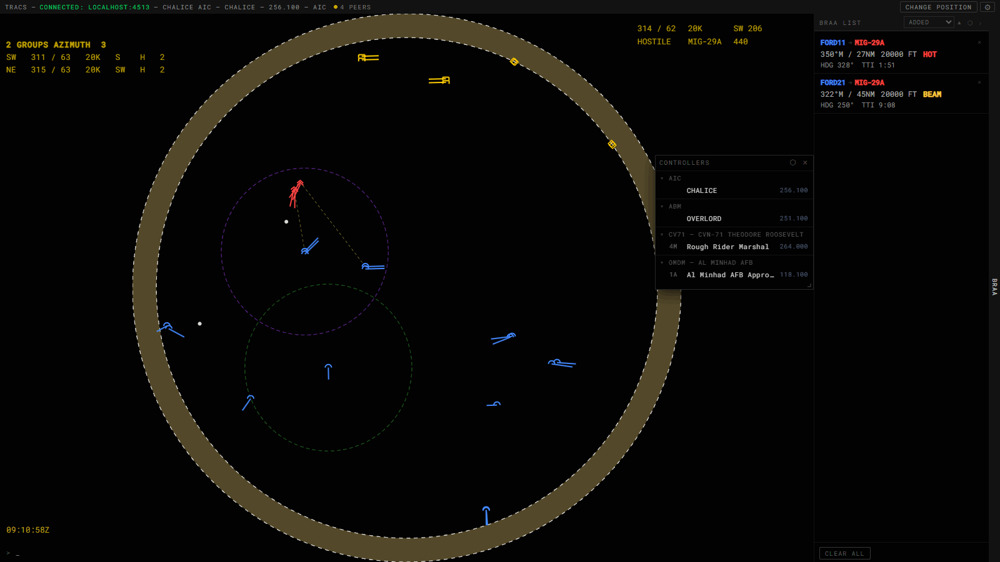

# AIC (Air Intercept Controller)

[← All docs](index.md)

Tactical display for airborne intercept control — AWACS/GCI style: bullseye-centered scope, hostile/friendly declaration, BRAA pairing, ROE tracking, and a doctrinal PICTURE readout (formation/group detection modeled on AWACS brevity doctrine).

Sign-in requires a Callsign and Frequency — see [Getting Started](getting-started.md).

## SRS transponder data (Mode 4 IFF)

When SRS transponder data reaches TRACS through a relay, AIC uses each contact's Mode 4 reply:

- A contact that has reported SRS transponder data at any point in the session ("SRS-fielded") defaults to **BOGEY** until it's declared, even if it's on your coalition. A contact without SRS data defaults to FRIENDLY if it's on your coalition, BOGEY otherwise.
- The hover readout shows an SRS-fielded contact's callsign only while its Mode 4 reply is valid. Otherwise the line reads `INVALID REPLY` or `NO REPLY`. The declaration itself doesn't change when Mode 4 drops. A contact without SRS data shows its callsign when it's declared FRIENDLY.
- `.autodec iff` declares SRS-fielded contacts FRIENDLY only on a valid Mode 4 reply (see Declaration below).

The BRAA panel and bogey dope use each contact's declaration only. Mode 4 has no effect on them.

## Command line

Click the scope to focus it, type, then press **Enter** to run most commands. A few commands work differently: type them, then **click a contact on the scope**. Pressing Enter on those does nothing useful, and each one is marked below.

`ArrowUp`/`ArrowDown` cycle through your last 50 commands. While a `.define` readout is open, they step alphabetically through the brevity glossary instead. `Backspace` deletes a character. `Escape` cancels pending state (see Keyboard, below).

### Display / scope settings

| Command | Effect |
|---|---|
| `.center` | Re-center on bullseye |
| `.center <brg> <rng>` | Center at a magnetic bearing/range (NM) from bullseye |
| `.center <fixname>` | Center on a named nav fix |
| `.center` + click | Center on the clicked point |
| `.find <fixname>` | Drop a marker at a named fix (cleared by Escape) |
| `.define <term>` (or `.def <term>`) | Look up a tactical brevity term (ATP 1-02.1, April 2025) and show its full definition above the command line, e.g. `.define bogey dope`. A single letter, e.g. `.def a`, jumps to the first term starting with that letter. Stays up until dismissed (Escape, another `.define`, or clicking it) |
| `.be` | Reset bullseye to the mission bullseye (clears any override) |
| `.be` + click | Type `.be`, then click the map to override bullseye at that point |
| `.be <fixname>` | Override bullseye to a named fix/navaid/runway |
| `.be <lat> <lon>` | Override bullseye to explicit decimal-degree coordinates |
| `.rr` | Toggle range rings |
| `.rr <nm>` | Set range ring spacing (`0` = off) |
| `.ptl <seconds>` | Predicted Track Line length, 0–300s |
| `.sym <n>` | Symbol size, 1–5 |
| `.faded <seconds>` | How long a contact keeps showing (faded) after dropping out |
| `.geo` | Toggle coastline/boundary overlay |
| `.relief` | Toggle terrain relief shading |
| `.aspcolors <name>` | Set the map color palette by name |
| `.centroid` | Toggle a marker at the hostile-picture centroid |
| `.axis` | Toggle a line along the computed threat axis |
| `.bec` | Toggle bullseye-on-cursor — bearing/range readout that follows the mouse (off by default) |
| `.clear` | Clears threat rings, RBL, sector, PICTURE-ack state, and **all** BRAA pairs |

### Declaration

| Command | Effect |
|---|---|
| `.dec` | Reset all declarations to default and turn auto-declare off |
| `.dec <old> <new>` | Bulk-redeclare every contact currently `<old>` to `<new>` — letters `f`/`n`/`b`/`h` for friendly/neutral/bogey/hostile, e.g. `.dec b h` |
| `.autodec` | Toggle auto-declare. Turning it on sets every visible contact to its true coalition (friendly/neutral/hostile, never bogey), overwriting existing declarations. While it's on, each newly visible undeclared contact is declared the same way |
| `.autodec iff` | Toggle IFF-gated auto-declare. Only ever declares FRIENDLY: a same-coalition contact without SRS data is declared unconditionally, an SRS-fielded one only when its Mode 4 reply is valid. Turning it on applies this to every visible qualifying contact, overwriting existing declarations. It never *declares* hostile/neutral/bogey. Mutually exclusive with `.autodec` |

You can also declare contacts with the F-keys and a click (see Keyboard, below).

### ROE

`.roe free` / `.roe tight` / `.roe hold` — sets weapons status, shown top-left. Bare `.roe` toggles visibility of the ROE readout itself (visible by default).

### Threat rings

| Command | Effect |
|---|---|
| `.threat` (Enter) | Clears all threat rings |
| `.threat`, then click a contact | Toggles that contact's ring |
| `.threat <nm>` (Enter) | Sets the ring radius used by manual/auto rings |
| `.threat <nm>`, then click a contact | Sets radius and toggles that contact's ring |
| `.autothreat` | Toggle automatic lighting — any friendly within radius of a hostile/bogey lights up automatically |

### PICTURE panel

`.picture` toggles the PICTURE readout. It's off by default.

The panel groups hostile and bogey contacts into formations (single, azimuth, range, wall, vic, champagne, ladder, box, leading edge). It uses doctrine-style naming and amplifiers (opening/closing, weighted, follow-on, echelon). The panel header shows the group's dimensions (e.g. "12 WIDE 8 DEEP") next to the formation label.

With a sector defined, only contacts inside the sector count. With no sector, every visible hostile/bogey contact counts, and the header is prefixed with `~`.

| Command | Effect |
|---|---|
| `.sector` | Re-shows a hidden sector, or reports `NO SECTOR` if none is defined |
| `.sector clear` / `.sector off` | Clears the sector |
| `.sector <fromBrg> <toBrg> <rngNm>` (Enter) | Defines a sector wedge centered at the bullseye |
| `.sector <fromBrg> <toBrg> <rngNm>`, then click on the scope | Same, but places the origin at the clicked point |
| `.sector` (bare, sector already exists), then click | Moves the existing sector's origin without retyping the arc |

Click the PICTURE panel to acknowledge the current picture. This stops its alert flash until the group composition changes again.

### Type-then-click-only commands

| Command | Effect |
|---|---|
| `.rename` / `.rename <newcallsign>`, then click a contact | Renames it (blank name resets to default), synced to other controllers |
| `.dope`, then click a fighter | Pairs it in the BRAA list with the nearest contact declared hostile or bogey (same as Alt+click, below) |

## BRAA List

Bearing/Range/Altitude/Aspect pairs, shown in a side panel you can dock or undock. The list is **not synced between controllers** — each AIC position keeps its own.

**Adding a pair:**
- **Ctrl+click** a contact to mark it as the fighter, then click a second contact to complete the pair. Ctrl+click the same contact again to cancel.
- **Alt+click** a fighter — auto-pairs it with the nearest contact declared hostile or bogey (bogey dope).

**Removing a pair:**
- **Shift+click** a contact on the scope — removes every pair involving that unit.
- Shift+click a row, or its **×** button, in the BRAA panel.
- **Clear All** button (confirms first), or the `.clear` command.

**Per-row display:** fighter → bogey, colored by declaration. A unit declared FRIENDLY is labeled by callsign; any other unit is labeled by aircraft type. When both units are live, each row shows:
- bearing/range (magnetic), altitude, and aspect (Hot/Flank/Beam/Cold)
- speed/altitude flags (High/Fast/Very Fast) where applicable
- a computed intercept heading and time-to-intercept, or "NO INTERCEPT" if no valid geometry exists

If either unit drops off radar, the row shows "NO DATA" and comes back automatically when the unit reappears.

Rows are listed in the order they were added. Mouse wheel on the panel's title bar zooms its display scale.

## Mouse

| Gesture | Action |
|---|---|
| Left-drag | Draw a range/bearing line (RBL) |
| Shift+click a contact | Remove all BRAA pairs for that unit |
| Ctrl+Alt+click a contact | Toggle a manual threat ring |
| Ctrl+click a contact | Start/complete a BRAA pair |
| Alt+click a contact | Bogey-dope: auto-pair nearest hostile/bogey |
| Mouse wheel | Zoom range (±5 NM per step, ±10 NM with Ctrl), 10–600 NM |
| Click the mission clock | Toggle Zulu / theatre-local time |
| Right-click | No context menu |

## Keyboard

| Key | Effect |
|---|---|
| `F1` / `F2` / `F3` / `F4` | Arm a pending declaration — Hostile / Bogey / Neutral / Friendly — then click a contact to apply it. Press the same key again to cancel. Also cancels a pending BRAA pairing |
| `Escape` | Clears one thing per press: a `.find` marker first, then a `.define` readout. Next come any pending declaration, pending BRAA pairing, typed command, or command feedback, all cleared together. Once none of those remain, it clears the RBL and hides the sector |
| `Enter` | Runs the current command |
| `Ctrl+Left` / `Ctrl+Right` | Shows / hides the BRAA list (app-wide, see Getting Started) |
| `Ctrl+M` | Opens Messages — a general chat window shared across all modules (DM another position with `.chat <POSITION>`, broadcast to everyone with `/ <text>`) |

Typing into the command line cancels any pending F-key declaration and BRAA pairing.
