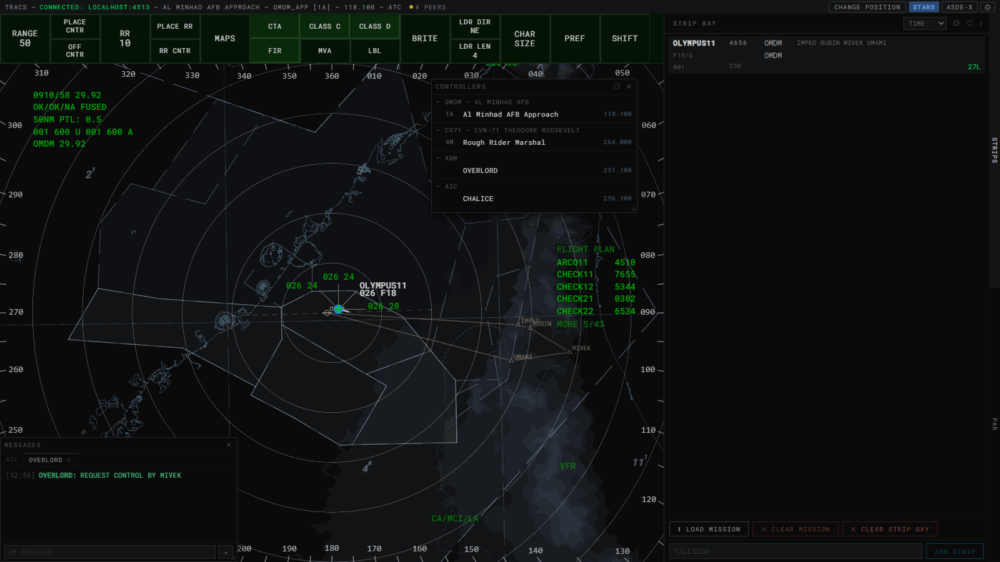
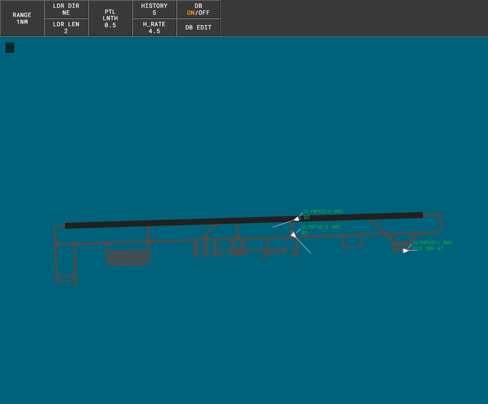
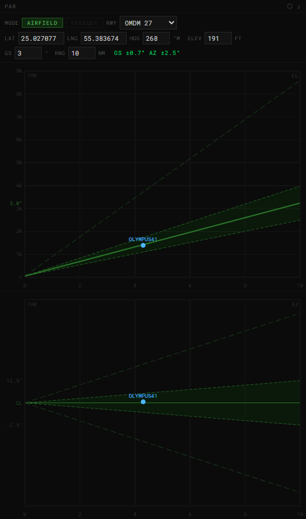

# ATC (Air Traffic Controller)

[← All docs](index.md)

Approach/departure radar display with a STARS-style command line, plus three sub-tools: **ASDE-X** (ground radar), **PAR** (precision approach radar), and **Strip Bay**.

## Command line basics

Commands are typed into the preview buffer, then resolved one of two ways:

- **ENTER** — the buffer is evaluated as typed; no target needed.
- **SLEW** — the buffer is evaluated against the contact you click. Type the command, then left-click a target to complete it.

Each command below reads as `COMMAND + ENTER` or `COMMAND + SLEW`.

When a command starts with a function key, the preview area shows the key's label on its own line and the rest of the entry below it. For `MF`, the label includes the next key: F7 then `S` shows `FS`, with the rest of the entry on the next line.

A **FLID** (flight ID) in an ENTER form can be a flight plan's AID, a 4-digit beacon code, or a live callsign.

A bare click with an empty buffer depends on the track's state:
1. If the track has an unacknowledged conflict alert, the click acknowledges it (see Conflict Alert below).
2. Otherwise, if a handoff or point-out involving that track is pending, the click accepts or recalls it.
3. Otherwise, the click toggles the track's datablock between partial and full.

## Track ownership

| Command | Shortcut | Effect |
|---|---|---|
| `IC` + SLEW | `F3` | Initiate Control — claim the clicked track |
| `TC` + SLEW | `F4` | Terminate Control — drop the clicked track (must be yours) |
| `TC ALL` / `.DROPALL` + ENTER | — | Drop every track you own |
| `.FORCEDROP` + SLEW | — | Drop the clicked track, whoever owns it. For a track stuck under a controller who has gone |
| `.FORCEDROP ALL` + ENTER | — | Drop every orphaned track (its owner's ID isn't held by any signed-on controller) and reply `FORCEDROP` with the count |

Nothing drops orphaned tracks automatically. Right after you join, or while the network is split, the controller list can be incomplete and live tracks would look orphaned, so check the controller list before using `.FORCEDROP ALL`.

**Ctrl+Shift+Click** a contact is a direct shortcut for `IC`.

`IC` fails with `ILL TRK` on a track that's unassociated (see Transponder/IFF correlation below).

## Handoffs

| Command | Shortcut | Effect |
|---|---|---|
| `HO` + ENTER | — | Accept the first incoming handoff |
| `HO <tcp>` + SLEW | `F5` | Hand off the clicked (owned) track to position `<tcp>` |
| `HO` + SLEW | — | On the clicked track: recall it if it's your outgoing handoff, accept it if it's incoming to you |
| `<tcp>` (e.g. `1D`) + SLEW | — | Shorthand for `HO <tcp>` |

`F5` inserts the `HO ` prefix into the buffer — type the position id, then click a track.

## Point outs

| Command | Shortcut | Effect |
|---|---|---|
| `<tcp>*` + SLEW | — | Point out the clicked track to position `<tcp>` |
| `**` + SLEW | — | Convert an incoming point-out into a claimed handoff |
| `UN` + SLEW | — | Reject an incoming point-out |

A bare click (empty buffer) on a track with a pending point-out also resolves it:
- on your own outgoing point-out, it **recalls** it;
- on a point-out sent to you, it **acknowledges** it;
- on your point-out that the other position rejected (shown as `UN`), it **dismisses** the `UN` indicator.

No function key is mapped to point outs.

## Scratchpads and altitudes

You must own a track to edit its scratchpads or temporary altitude.

| Command | Shortcut | Effect |
|---|---|---|
| `MF Y<text>` + SLEW | `F7` | Set scratchpad 1 (SP1) |
| `MF Y` + SLEW | `F7` | Clear SP1 |
| `<text>` (3–4 characters) + SLEW | — | Set SP1. A bare 3-digit entry (e.g. `070`) also sets SP1 |
| `+<text>` (1–4 characters, not 3 digits) + SLEW | — | Set scratchpad 2 (SP2) |
| `.` + SLEW | — | Clear SP1 |
| `+` + SLEW | — | Clear SP2 |
| `+###` + SLEW | — | Set the temporary assigned altitude, shown as `A###` on FDB line 3. `+000` clears it |
| `++###` + SLEW | — | Amend the flight plan's requested (filed) altitude |
| `Δ<text>` + SLEW | `` ` `` | Set SP1 (up to 3 characters) |
| `MF MΔ<text>` + SLEW / `MF M<flid> Δ<text>` + ENTER | `F7` | Set SP1 |
| `MF M+<text>` + SLEW / `MF M<flid> +<text>` + ENTER | `F7` | Set SP2 |
| `MF MΔ###` + SLEW / `MF M<flid> Δ###` + ENTER | `F7` | Set the temporary assigned altitude. `000` clears it |
| `MF M###` + SLEW / `MF M<flid> ###` + ENTER | `F7` | Amend the requested (filed) altitude. The ENTER form also works on a flight plan with no track yet |
| `MF M####` + SLEW / `MF M<flid> ####` + ENTER | `F7` | Assign a specific beacon code to the flight plan (octal). `DUP BCN` if another plan has it |

`F7` inserts the `MF ` prefix.

A requested altitude amended with `++###` shows as `R###` on FDB line 2 in clock phase 3 (see Datablocks below). Editing the altitude in the Flight Plan Editor removes the `R###`. The temporary assigned altitude stays on the right of line 3 until it's cleared. On a beacon code mismatch it time-shares with the flashing assigned code.

## Datablocks

Datablock fields time-share on a clock. The ODS profile sets the sequence, which defaults to phases 1, 2, 1, 3.

**FDB**

| Line | Content |
|---|---|
| 0 | Safety alerts and special conditions in red, separated by `/`: `MCI`, the squawked SPC, `LA` (MSAW), a controller-entered SPC, `CA`. Unacknowledged alerts flash |
| 1 | Aircraft ID, then `*` (MSAW inhibited), `+` (MSAW and CA inhibited) or `▲` (CA inhibited), then `PO`/`UN` |
| 2 left | Phase 1: altitude + handoff letter. Phase 2: SP1, else SP2 + `+`, else altitude. Phase 3: the other position of a pending handoff, else SP2 + `+`, else SP1, else altitude. Phase 4: blank. An active `CA`/`MCI`/`LA` holds altitude in every phase |
| 2 right | Phase 1: groundspeed + flight rules (`V` for VFR). Phases 2 and 4: aircraft type. Phase 3: `R###`, else aircraft type. An empty slot falls back to groundspeed. While IDENTing, a flashing `ID` replaces the flight-rules character in every phase |
| 3 | Left: the reported code on a mismatch, or `DB` for a duplicate beacon code (see below). Right: `A###` temporary altitude, and/or the flashing assigned code on a mismatch |

A **VFR** flight plan shows `V` after the groundspeed (e.g. `30V`) and `*` after the aircraft ID, because VFR plans are MSAW-inhibited automatically.

**PDB:** altitude/scratchpad by phase, then groundspeed + flight rules (aircraft type in phase 2). An IDENTing PDB stays a PDB with a flashing `ID`. Any active safety alert or special condition turns it into an FDB.

**Duplicate beacon (`DB`):** shown on an associated FDB when another visible track squawks the same code. 1200 and the SPC codes never count. Slewing the track acknowledges it for that code.

**Selected beacon code:** `**####` + ENTER flashes that code in yellow on every track squawking it for 15 seconds: line 1 of an LDB, or line 3 of an FDB. `NO TRK` if no track squawks it.

## Leader lines

| Command | Shortcut | Effect |
|---|---|---|
| `MF L<d><d>` (same digit twice, e.g. `MF L33`) + SLEW | `F7` | Set the default leader direction (same setting as the **LDR DIR** DCB control); digit `5` returns to the profile default |
| `MF L<d>` + SLEW | `F7` | Set direction for one track |
| `<d>` (single digit 1–9) + SLEW | — | Shorthand for `MF L<d>` |
| `LD <0-7>` + ENTER | — | Set leader length (same setting as the DCB's LDR LEN) |

Direction digits follow a numpad layout: `7`=NW `8`=N `9`=NE `4`=W `5`=clear/default `6`=E `1`=SW `2`=S `3`=SE.

## Range/bearing line & minimum separation

| Command | Shortcut | Effect |
|---|---|---|
| `*T` + SLEW | — | Start an RBL from the clicked track (or clicked point on empty scope); click again, or type a fix + Enter, for the second point |
| `*T <fix>` + ENTER | — | Start an RBL from a named fix |
| `*T` + ENTER | — | Clear all RBLs |
| `*T<n>` + ENTER | — | Clear RBL number `n` |
| `MIN` + SLEW | `End` | Pick the clicked track as the first aircraft of a minimum-separation pair; click a second track to complete it |
| `MIN` + ENTER | `End` | Clear the min-sep display |

`End` inserts `MIN` into the buffer.

`MF R` + SLEW toggles a predicted track line (PTL) for the clicked track. It draws regardless of the DCB's facility-wide **PTL OWN**/**PTL ALL** settings, using the **PTL LNTH** length.

## Display, range, and reference commands

| Command | Shortcut | Effect |
|---|---|---|
| `RG <n>` + ENTER | — | Set range, 6–256 NM (in km under `.METRIC`, about 11–474) |
| `RR (2\|5\|10\|20)` + ENTER | — | Set range-ring spacing |
| `.CENTER` + ENTER | `Ctrl+F1` | Return the scope to its original center (same as the DCB's OFF CNTR) |
| `MF P` + SLEW | `F7` | Relocate the preview area (command line/response readout) to the clicked point |
| `MF S` + SLEW | `F7` | Relocate the SSA overlay |
| `MF S<atis>` + ENTER | — | Set the SSA overlay's ATIS code letter |
| `MF S<atis> <giText>` + ENTER | — | Set the SSA overlay's ATIS code letter and general-info text |
| `MF S` + ENTER | — | Clear the SSA overlay's ATIS code letter and general-info text (line 1) |
| `MF S*` + ENTER | — | Clear the ATIS code only |
| `MF S* <giText>` + ENTER | — | Clear the ATIS code and set the general-info text |
| `MF S<atis>*` + ENTER | — | Set the ATIS code and clear the general-info text |
| `MF S<1-9> <text>` + ENTER | — | Set an auxiliary general-info line, shown below line 1 in the SSA |
| `MF S<1-9>` + ENTER | — | Clear an auxiliary general-info line |
| `MF D` + SLEW / `MF D<flid>` + ENTER | `F7` | Show the flight plan (AID, type, beacon, altitude, route, flight rules) in the preview area |
| `.ALTIM <val>` / `.QNH <val>` + ENTER | — | Set altimeter (inHg or hPa, auto-detected by range) |
| `.ASPCOLORS <name>` + ENTER | — | Switch the airspace color palette |
| `.REFRESH` + ENTER | — | Reload airspace color palettes from the server |
| `.DBCA` + ENTER | — | Toggle datablock collision-avoidance placement: a track's own leader direction is always kept; every other datablock sits at the default leader direction unless that would overlap another datablock, cross another leader, or cover another track, in which case it moves to the nearest clear direction |
| `.LABELSIZE <0-5>` + ENTER | — | Set map/airspace label size (same as the DCB's CHAR SIZE > MAP); bare `.LABELSIZE` reports the current value |
| `.LABELS` (or `.LBL` / `.LABEL`) + ENTER | — | Toggle the LBL map button (map/airspace name labels) |
| `.FIXES` + ENTER | — | Toggle the FIXES map button (theatre fix points) |
| `.ASP` + ENTER | — | Bulk-toggle every airspace category map button |
| `.TMA` `.CTR` `.CTA` `.FIR` `.UIR` `.SUA` `.MIL` `.TRSA` `.CLASSA`–`.CLASSG` + ENTER | — | Toggle every map button (main + overflow) for that airspace category |
| `.MSA` + ENTER | — | Toggle the MSA map button |
| `.HOLDS` + ENTER | — | Toggle the HOLDS map button |
| `.RELIEF` + ENTER | — | Toggle the RELIEF map button |
| `.MVA` + ENTER | — | Toggle the MVA map button |
| `.SAT <label>` + ENTER | — | Toggle a satellite flow bucket map button (label varies by facility, e.g. `.SAT W`, `.SAT E`) |
| `.FILL` + ENTER | — | Toggle airspace polygon fill |
| `.FILL <1-100>` + ENTER | — | Set fill transparency % and turn it on |
| `.COORDS` + ENTER | — | Toggle a cursor lat/lng readout |
| `.METRIC` / `.IMPERIAL` + ENTER | — | Set display units for STARS, ASDE-X and PAR (default imperial). Metric shows distances in km, datablock altitude in hundreds of m and speed in tens of km/h (3 digits above 999 km/h), and MVA/MSA and elevation in m; `RG <n>` is read in km. Typed altitudes, speeds and flight plans stay in ft/kt |
| `.FIND <query>` + ENTER | — | Drop a marker at a named fix/navaid/airport |
| `.FIX <name...>` + ENTER | — | Force-show one or more fixes regardless of the FIXES toggle; each name toggles independently. Bare `.FIX` clears them all |
| `.PROC <name>` + ENTER | — | Toggle display of a named SID/STAR/approach procedure |
| `.PROC` + ENTER | — | Clear all shown procedures |
| `.RCLEAR` + ENTER | — | Clear every flight-plan route line currently displayed (see Ctrl+Right-click below) |
| `.FP <callsign>` + ENTER | — | Open the Flight Plan Editor prefilled for that callsign |
| `.FP` + ENTER | `Ctrl+F` | Open a blank Flight Plan Editor |
| `.RENAME <newCallsign>` + SLEW | — | Rename the clicked track's displayed callsign |
| `.RENAME` + SLEW | — | Reset callsign to the DCS-assigned one |

**Ctrl+Click** a contact opens its Flight Plan Editor (read-only if another controller owns it). In the editor, BCN rejects the reserved codes 0000, 1200, 2000, 7400, 7500, 7600, 7601, 7700 and 7777. ALT takes a cruising altitude in hundreds of feet (`300`, which makes the plan IFR), `VFR`, `OTP` (VFR-on-top), or `VFR/###` (e.g. `VFR/055`). `VFR` and `OTP` make the plan VFR.

## Multi-function (MF) lists

These lists appear only if your ODS profile enables coordination lists. `+ ENTER` toggles a list, `+ SLEW` relocates it to the clicked point, and the resize forms set its line count.

| List | Toggle | Relocate | Resize |
|---|---|---|---|
| SSA | always shown | `MF S` + SLEW | — |
| Sign-on list | `MF TS` + ENTER | `MF TS` + SLEW | — |
| Flight-Plan (TAB) list | `MF T` + ENTER | `MF T` + SLEW | `MF T<n>` + ENTER |
| Tower lists 1–3 (all three currently show your facility's airport) | `MF P1`/`P2`/`P3` + ENTER | `MF P<n>` + SLEW | `MF P<n> <lines>` + ENTER |
| Coast/Suspend list | `MF TC` + ENTER | `MF TC` + SLEW | `MF TC<n>` + ENTER |
| Alert list | `MF TM` + ENTER | `MF TM` + SLEW | — |
| VFR list | `MF TV` + ENTER | `MF TV` + SLEW | `MF TV<n>` + ENTER |
| MCI suppression list (hidden by default): every flight with a `CA M` code | `MF TQ` + ENTER | `MF TQ` + SLEW (also shows it) | — |

## Transponder/IFF correlation

When SRS transponder data reaches TRACS through a relay (in Tacview or Olympus sessions), tracks that report SRS data ("SRS-fielded") use squawk-based association:

| Item | Effect |
|---|---|
| **Association** | An SRS-fielded track is *associated* when its squawk matches a filed flight plan's callsign and code, and *unassociated* otherwise. Once associated, it stays associated if the code later drifts (see the mismatch line). Unassociated tracks can't be claimed |
| **Primary-only** | An SRS-fielded track with no live squawk draws as a primary target with no datablock |
| **Unassociated LDB** | Altitude only. The beacon code shows on the line above it while IDENTing, squawking an SPC, under the beaconator, during a selected-code display, or when turned on with `MF B` (all LDBs: `MF B` / `MF BE` / `MF BI` + ENTER; one track: `MF B` + SLEW). Slewing the track opens a full LDB for 5 seconds: code, altitude and groundspeed, and its callsign |
| **Position symbols** | An owned, associated track shows its owner's position letter. An unassociated track squawking 1200 shows `V`. Every other track shows `*` |
| **FDB mismatch line** | If an associated track's live squawk differs from its flight plan's assigned code, FDB line 3 shows the reported code and the flashing assigned code. SPC squawks don't count as a mismatch |
| **IDENT** | A pilot's IDENT press appends a blinking "ID" to the datablock (only the suffix blinks), latched until you acknowledge it with a slew on that track |
| **Beaconator** | Press and hold `F1`. Every squawking SRS-fielded associated track shows an FDB with its beacon code in place of the aircraft ID, including tracks you own. Every LDB shows its code, with the callsign underneath. The altitude filter still applies. Release to return to normal |

## Flight plan creation

| Command | Shortcut | Effect |
|---|---|---|
| `DA <aid> [fields]` + ENTER | `F6` (FLT DATA) | Create an abbreviated flight plan, or amend it if the AID already exists |
| `VP <aid> [dep*] <dest> <type>[/eq] [###]` + ENTER | `F9` (VFR PLAN) | Create or amend a VFR flight plan, e.g. `N925RC BOS* BTV C172/G 065` |
| `<aid> [fields]` + ENTER | — | Implied form, with no function key first. Tried as FLT DATA fields, then as VFR PLAN fields |

FLT DATA fields can be in any order:

| Field | Format |
|---|---|
| Beacon code | 4 octal digits, e.g. `4304`. Assigned automatically if omitted |
| Scratchpad 1 | `Δ` + up to 3 characters |
| Scratchpad 2 | `+` + up to 3 characters |
| Aircraft type | 4 characters starting with a letter (pad with `*`), optional `/equipment` |
| Requested altitude | 3 digits, hundreds of feet |
| Flight rules | `.V` VFR, `.P` VFR-on-top, `.E` IFR. A new plan is VFR if omitted |

Example: `N925RC 4304 ΔVFF C182 065`. After a plan is created or amended, the preview area shows its AID and beacon code. Scratchpads entered this way are stored on the plan and show in the datablock once the track associates, until the track's own scratchpad is set or cleared.

In the implied form, a command word (`RG`, `HO`, `MIN` and so on) is never taken as an AID. An airport code like `KBTV` also looks like an aircraft type, so an ambiguous implied entry is read as FLT DATA; use `F9` to force the VFR PLAN reading.

## Conflict Alert / MCI

`.CA` + ENTER toggles automated conflict detection. It checks the airborne aircraft visible on your scope. Aircraft on the ground never alert, and neither does an SRS-fielded aircraft whose transponder is on standby or off. A track is *associated* when it has a flight plan or an owner.

| Alert | Pair | Triggers within |
|---|---|---|
| `CA` | Two associated tracks | 3 NM and 1,000 ft |
| `MCI` | An associated track and an unassociated one | 1.5 NM and 500 ft |

Separation is tested on current positions. A pair whose tracks are diverging (their paths cross behind at least one of them and differ by 15° or more) doesn't alert. Once an alert starts, it stays up until the pair diverges or separates to 3.5 NM / 1,100 ft (CA) or 1.75 NM / 600 ft (MCI). Suppression zones along final approach courses prevent alerts between aircraft established on approach.

- The alert shows as a blinking red `CA` above line 1 of the datablock (MCI also shows as `CA` there), and a PDB in conflict becomes an FDB. The alert list labels each row `CA` or `MCI`, with the oldest alert first.
- A bare left-click on a track with an active, unacknowledged conflict acknowledges it on your scope only, and the indicator turns solid red.
- An alert tone plays for 5 seconds from the start of a new conflict, or until it's acknowledged, if you own one of the pair. Its volume follows the DCB's **VOL**, and the app-wide **Sounds** checkbox in Settings (see [Getting Started](getting-started.md)) mutes it.

The DCB aux bar (SHIFT) has a **CA** toggle button next to **WNG**.

| Command | Shortcut | Effect |
|---|---|---|
| `CA K` + SLEW / `CA K <flid>` + ENTER | `F11` | Turn conflict alerts off or on for one track (`CA INHIBITED` / `CA ENABLED`). With a flight plan it's stored on the plan, for every controller, and clears any MCI suppression. Without one it stays on your scope until the track gets a flight plan, then moves onto the plan. Shown as `▲` after the aircraft ID |
| `CA M####` + SLEW / `CA M <flid> ####` + ENTER | `F11` | On a track you own, suppress MCI alerts against intruders squawking `####`. The same code again clears it. Setting a code turns CA back on for the track. Stored like `CA K`. Shown as `▲` |
| `CA M` + SLEW / `CA M <flid>` + ENTER | `F11` | Toggle MCI suppression with the default code 0477 |

AI aircraft don't squawk, so `CA M` only ever matches SRS-fielded intruders.

## Special conditions (SPC)

A track squawking 7400 (`LL`), 7500 (`HJ`), 7600 (`RF`), 7700 (`EM`) or 7777 (`MI`) shows that tag in red above its datablock, on LDBs and FDBs. An associated track becomes an FDB. The tag flashes and a tone sounds for 5 seconds until you acknowledge it with a slew on the track. After that the tag stays solid while the code is squawked. Acknowledging only affects your scope. Only SRS-fielded tracks report a squawk, so AI aircraft never raise an SPC.

`EM`, `HJ`, `RF`, `LL` or `MI` + SLEW forces an associated track (one with a flight plan) into that special condition. The tag shows steady, with no tone, and makes the track an FDB on every scope. Entering the same code again removes it. `ILL FNCT` if the aircraft is already squawking an SPC.

## Minimum safe altitude warning (MSAW)

MSAW checks the tracks you own anywhere in the theatre, against the highest terrain in 2 NM square bins. A track alerts in three cases:
- it's less than 500 ft above its current bin
- it's projected to be less than 300 ft above the terrain within 30 seconds, along its current heading, groundspeed and climb or descent rate (averaged over about 10 seconds)
- even a 5° climb started at the 30-second point wouldn't keep it 300 ft above the terrain over the following 30 seconds

MSAW ignores tracks on the ground and within 3 NM of an airbase. Carriers aren't exempt. Helicopters are included; use `MF V` or `MF Q` for low-level traffic.

An alerting track gets a flashing red `LA` above its FDB, an `LA` row in the alert list, and a 5-second tone. Altitude holds in every phase of line 2. A slew acknowledges it.

| Command | Shortcut | Effect |
|---|---|---|
| `MF Q` + SLEW | `F7` | Inhibit the active MSAW alert on a track you own. It re-arms once the track is back above the MVA |
| `MF V` + SLEW | `F7` | Turn MSAW off or on for one track. With a flight plan it's stored on the plan, for every controller. Without one it's kept on the track for your scope only, so a controller you hand off to won't have it, until the track gets a flight plan; then the setting moves onto the plan. Shown as `*` after the aircraft ID |
| `MF VMI` / `MF VME` + ENTER | `F7` | Turn MSAW off / on for your scope |

VFR flight plans are MSAW-inhibited automatically. Changing a plan's flight rules resets this, unless `MF V` sets it.

## Acknowledging with a slew

A bare left-click on a track handles one thing per click, in this order: an IDENT (always cleared alongside), then a conflict alert, an MSAW alert, an SPC alert, and a duplicate-beacon indicator. On an unassociated track it opens the full LDB. Otherwise it does the usual handoff, point-out or PDB toggle.

## Simulated wingmen

`.WNG` + ENTER toggles simplified rendering for AI wingmen (tracks without SRS data) that share a DCS group with a flight lead:

- Only the flight lead gets a full datablock; the rest of the group renders as a small hollow diamond with no datablock.
- `.WNG` + SLEW, then click a second track, manually pairs two aircraft that don't share a DCS group (same two-click flow as `MIN`/RBL).
- A primary-only (wingman) track can't be claimed with `IC`.

SRS-fielded tracks aren't grouped this way. Their primary-only state depends only on whether they're squawking (see above).

The DCB aux bar (SHIFT) has a **WNG** toggle button next to **CA**.

## Altitude filters

`MF F` + ENTER shows your current altitude filter. Two ways to set one:

| Command | Effect |
|---|---|
| `MF FC<loAssigned><hiAssigned>` + ENTER | Set the filter for tracks shown with an owner letter |
| `MF F<loUnassoc><hiUnassoc> <loAssigned><hiAssigned>` + ENTER | Set both the filter for `*`/`V` tracks and the filter for tracks with an owner letter |

Tracks outside the active filter range don't draw. Tracks with no altitude data are never filtered.

## Top-down mode (TDM)

**Ctrl+T** (desktop app) or **Alt+T** toggles top-down mode. Ctrl+T doesn't work in a browser tab, which always opens a new tab on it.

The scope normally hides aircraft on the ground (parked or taxiing). With TDM on:
- Those contacts draw too, so you can see aircraft on the ground and taxiing.
- Airport surfaces (taxiway and runway pavement) draw under every other layer, at MAP B brightness. They cover the airports within the same radius DCB MAP uses for runways: 60 NM for APP, 30 NM for TWR, and the whole theatre for CTR.

## Mouse gestures

| Gesture | Effect |
|---|---|
| Left-click, empty buffer | Acknowledge an unacknowledged conflict on that track; otherwise accept/recall a pending handoff or point-out; otherwise toggle partial/full datablock |
| Right-click + drag | Pan the scope |
| Middle-click a contact | Toggle a local highlight (not synced, not persisted) |
| Ctrl+Click a contact | Open its Flight Plan Editor |
| Ctrl+Shift+Click a contact | Initiate Control |
| Ctrl+Right-click a contact | Toggle that track's flight-plan route line |
| Mouse wheel | Zoom range (±1 NM per notch, ±3 with Ctrl), 6–256 NM; inactive while a DCB value button is selected |

## Display Control Bar (DCB)

Click a value button, then use the **mouse wheel** to adjust it. Click a submenu button to open it; **DONE** exits back to the main bar.

**Main bar:**

| Button | Effect |
|---|---|
| **RANGE** | Scope range |
| **PLACE CNTR** | Click the button, then click the scope: that point becomes the scope center |
| **OFF CNTR** | Lit while the scope is off its original center; click to return to it |
| **RR** | Ring spacing |
| **PLACE RR** | Click the button, then click the scope to set an off-center ring origin |
| **RR CNTR** | Reset the ring origin |
| **MAPS** | Map submenu (see below) |
| Map buttons (6) | Facility airspace-category toggles, plus **LBL** (name labels). When the facility has an MVA layer, one of these slots is the **MVA** toggle |
| **BRITE** | Brightness submenu: Map A, Map B, background, FDB, LDB, lists, position symbols, rings, compass, history, and the DCB itself |
| **LDR DIR** | Leader line direction |
| **LDR LEN** | Leader line length |
| **CHAR SIZE** | Submenu: datablocks/lists/DCB/tools/position/map |
| **PREF** | 12 preset slots: save/save-as/delete/default |
| **SHIFT** | Switch to the aux bar |

**MAPS submenu:** HOLDS, MSA, airways (V, J, B), GRID/MORA, RELIEF, GEO, FIXES, any further airspace categories that don't fit on the main bar, OBST (obstacles, when the facility has any), one button per facility runway centerline, satellite flow buckets (see `.SAT` above), and one button per SID/STAR/approach procedure group.

**Aux bar (via SHIFT):**

| Button | Effect |
|---|---|
| **VOL** | Alert volume |
| **CA** / **WNG** | Conflict Alert / simulated wingmen toggles |
| **HISTORY** / **H_RATE** | Trail dot count / capture interval |
| **DCB TOP/LEFT/RIGHT/BOTTOM** | Reposition the bar |
| **PTL LNTH** | Predicted track line length |
| **PTL OWN** / **PTL ALL** | Predicted track lines for your tracks only / all tracks |

## Keyboard shortcuts

These keys insert text into the buffer; you still complete the command with a click (SLEW) or Enter.

| Key | Inserts | Effect |
|---|---|---|
| `F3` (also `Shift+F3`) | `IC` | Init Control — click a track to claim it |
| `F4` | `TC` | Term Control — click a track to drop it |
| `F5` | `HO ` | Hand Off — type a position id, then click a track |
| `F6` | `DA ` | Flight Data — create an abbreviated flight plan |
| `F7` | `MF ` | Multi-Function prefix — follow with a list/scratchpad/leader command |
| `F9` | `VP ` | VFR Plan — create or amend a VFR flight plan |
| `F11` | `CA ` | Conflict Alert — `CA K` inhibits alerts for one track, `CA M` suppresses MCI for one code |
| `End` | `MIN` | Minimum-separation tool |
| `` ` `` (backquote) | `Δ` | Inserts the delta glyph |

`F2` (TRK RPOS) and `F13` insert `RP ` and `F13 `. No command uses these prefixes yet.

These act immediately, without the buffer:

| Key | Effect |
|---|---|
| `Ctrl+F` | Open a blank Flight Plan Editor |
| `F1` (press and hold) | Beaconator (see Transponder/IFF correlation above) |
| `Ctrl+F1` | Return the scope to its original center (same as `.CENTER`) |
| `Ctrl+F8` | Show/hide the DCB |
| `Ctrl+T` / `Alt+T` | Toggle [top-down mode](#top-down-mode-tdm) (Ctrl+T in the desktop app only) |
| `Ctrl+Alt+0`–`9` | Save current view (center/range/overlays) to bookmark slot 0–9 |
| `Ctrl+0`–`9` | Load view bookmark 0–9 |
| `Escape` | Clears the buffer. Each press also clears one pending item, in this order: displayed route lines, then a `.FIND` marker, then a pending RBL/MIN/WNG second point or PLACE CNTR/PLACE RR click |
| `Backspace` | Delete the last buffer character |
| `Enter` | Run the current buffer as an ENTER-triggered command |

---

## ASDE-X (ground radar)

A ground-movement sub-scope showing surface traffic (aircraft/helicopters below ~200 ft AGL) on taxiways and ramps.

**Commands:**

| Command | Effect |
|---|---|
| `.FP <callsign>` / `.FP` + ENTER | Open Flight Plan Editor (prefilled or blank) |
| `.CENTERLINE` + ENTER | Toggle runway centerline overlay |
| `.COORDS` + ENTER | Toggle cursor lat/lng readout |
| `.METRIC` / `.IMPERIAL` + ENTER | Set display units, shared with STARS and PAR (see STARS) |
| `.COLORS <name>` + ENTER | Switch color profile (e.g. Day/Night) |
| `<d>` (1–9) + SLEW | Set/clear a contact's leader-line direction (`5` clears) |
| `.TAG <id>` + SLEW | Manually tag a target: type the aircraft ID, then click the target. The ID must match the callsign TRACS displays for that aircraft; a mismatch returns `ILL TRK` |
| `.RENAME <newCallsign>` + SLEW | Rename the clicked aircraft's displayed callsign (shared with STARS) |
| `.RENAME` + SLEW | Reset callsign to the DCS-assigned one |
| `MF Y`, click target, `<text>` + ENTER | Set the aircraft's scratchpad 1 (up to 7 letters/digits; empty clears it) |
| `MF H`, click target, `<text>` + ENTER | Set the aircraft's scratchpad 2 |
| Left-click, empty buffer | Toggle that aircraft's datablock on/off |

**Unknown Targets:** an SRS-fielded target with no live squawk renders as a **teal** triangle with no datablock or leader line. It stops being an Unknown Target when it squawks or is tagged with `.TAG`.

**Datablock content:** a target that's associated, tagged, or has no SRS data shows its aircraft ID; a squawking target that's neither associated nor tagged shows its beacon code. In **FULL** mode the datablock adds:

| Line | Content |
|---|---|
| 0 | `DUP BCN` when two displayed targets squawk the same code and one of them is associated (shown in PART mode too) |
| 1 | Altitude in hundreds of feet after the ID/beacon code (`XXX` for an SRS target with no live squawk) |
| 2 | Aircraft type, fix, and velocity (groundspeed in tens of knots, or tens of km/h under `.METRIC`). If scratchpads are set, line 2 alternates every 2 seconds between these and the scratchpads |

The fix field shows the first three letters of the first known fix in the flight plan's route. If the route has no known fix, it shows the four-character destination, or nothing if the destination is this airport. **PART** mode shows only the ID/beacon code (plus `DUP BCN`). ASDE-X scratchpads are separate from STARS scratchpads, and they aren't shared with other controllers.

**Mouse:** Ctrl+Click opens a contact's FPE; right-click+drag pans; mouse wheel zooms (0.1–2.0 NM range, in 0.1 steps).

**DCB:** RANGE, LDR DIR, LDR LEN, PTL LNTH, HISTORY, H_RATE (same click-then-wheel interaction as the main ATC DCB), plus a split **DB ON/OFF** / **DB EDIT** button:

- **DB ON/OFF** — show or hide every datablock. This also resets any per-aircraft toggles made by clicking targets.
- **DB EDIT** — submenu with **FULL/PART** and ON/OFF selectors for **ALTITUDE**, **TYPE**, **FIX**, **VELOCITY**, and **SCRATCH PAD**. Click either word to choose it; the current choice is amber. **DONE** returns to the main bar. DB EDIT settings persist across reloads, as do the `.COLORS` profile and the `.CENTERLINE`/`.COORDS` toggles.

**Function keys:** **F6** toggles all datablocks (same as DB ON/OFF); **F7** is MULTIFUNC (`MF`).

## PAR (precision approach radar)

A form-driven panel with no command line.

- **AIRFIELD / CARRIER** buttons switch mode. CARRIER is enabled only when a carrier is known (docked under CATCC, or via URL parameter).
- Pick a **runway** (airfield mode) to auto-fill lat/lng/heading/elevation, or enter them manually.
- **GS** (glideslope angle, 1–7°, default 3.0° airfield / 3.5° carrier) and **RNG** (displayed range, default 10 NM) are editable and remembered per mode.
- Two plots:
  - **Elevation** (side view): glideslope, ±0.7° tolerance corridor, 8° service-volume ceiling, and in carrier mode a 1200 ft Case III minimum line.
  - **Azimuth** (top-down): centerline, ±2.5° tolerance corridor, ±10° service-volume cone.
- Contacts inside tolerance are gold (carrier) or blue (airfield); outside tolerance, orange.

## Strip Bay

Flight progress strips, handled by direct manipulation (no command line).

**Adding strips:** type a callsign into the footer input and press Enter or click **Add Strip**.

**Auto-add triggers** (the **⚙** settings button). Each one adds a strip for the aircraft's flight plan when enabled:

| Setting | Adds a strip when |
|---|---|
| On track initiation | You claim a track (`IC`, Ctrl+Shift+Click) |
| On handoff acceptance | You accept an incoming handoff |
| On strip pass acceptance | Another controller sends you a strip |
| On DEP airport match | A flight plan is created, or its DEP changes, and its DEP is your facility or in the listed airports |
| On DEST airport match | Same, for DEST |

Other settings:
- **Ignore all incoming strip passes** — drops strips sent to you.
- **Delete strip on drop track** — removes a strip when you drop its track.
- **Annotation conflict** — Overwrite, Merge, or Ignore, for when a received strip's annotations differ from yours.

All of these settings are saved across reloads, and changes made in an undocked Strip Bay window apply to the main window too.

**Bulk flight-plan import:**
- The footer's **⬆ Load Mission** button accepts a `.miz` mission file, a CSV, or a DCS Data Transfer Cartridge (`.dtc`, F-16C/F/A-18C). Each produces flight plans to review, with per-row collision handling, before committing.
- **✕ Clear Mission** appears once imported flight plans exist. It deletes them session-wide, for every controller, after a confirmation.
- **✕ Clear Strip Bay** appears when the bay has strips. It clears only your own strips, after a confirmation, and leaves the flight plans in place.

**Per-strip mouse actions:**

| Gesture | Effect |
|---|---|
| Click | Acknowledge a highlight (e.g. auto-added flag) |
| Shift+Click | Delete immediately, no confirmation |
| Ctrl+Click or double-click | Open the strip's Flight Plan Editor on whichever scope is showing (STARS or ASDE-X) |
| Right-click | Context menu: Delete, or "Send to `<position>`" for any known controller |
| Drag | Reorder strips (switches sort mode to Manual) |

**Annotation cells:** each strip has a 3×3 grid of editable cells (up to 3 characters each). Click to edit; Enter or clicking away saves; Escape restores the previous value.

**Header controls:** sort by Time/AID/DEP/DEST/Manual; mouse wheel over the header zooms strip scale (50–200%).

---

## Known limitations

These ATC commands are recognized but not functional:

- `IC <flightid>`, `TC <flightid>` and `HO <tcp> <flightid>` + ENTER reply `NOT SUPPORTED`. Use the SLEW forms (type the command, then click the track).
- `MF M` (Mode C toggle) and `MF E` (FDB overflight toggle) reply `NOT SUPPORTED`.
- Quicklook (`**<tcp>`, `**ALL`) replies `NOT SUPPORTED`.
- Ctrl+F2–F5, Ctrl+F7, Ctrl+F9, Ctrl+F10, and Insert have no effect.
